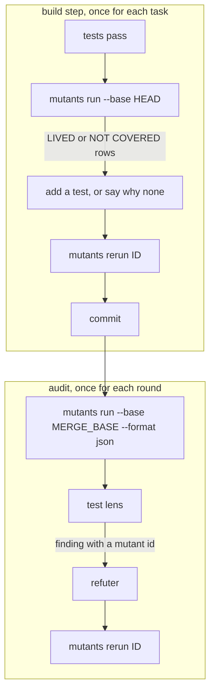
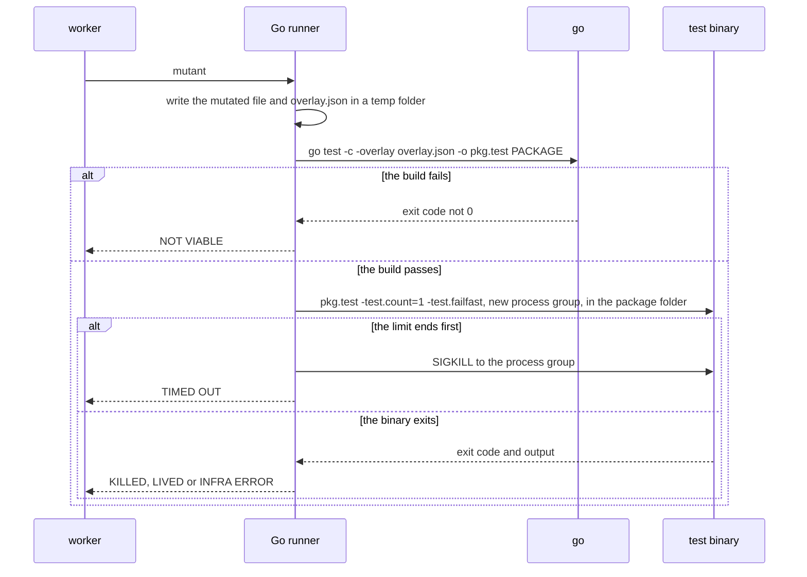
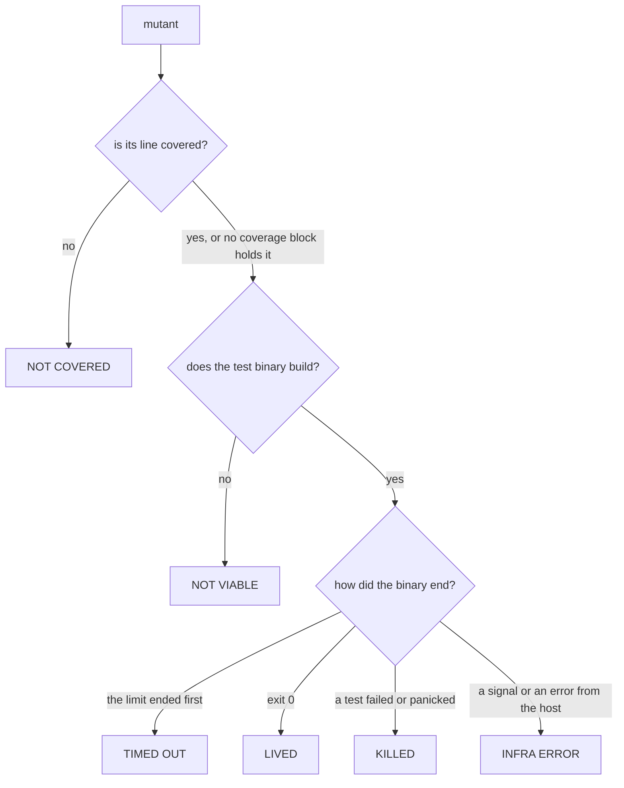
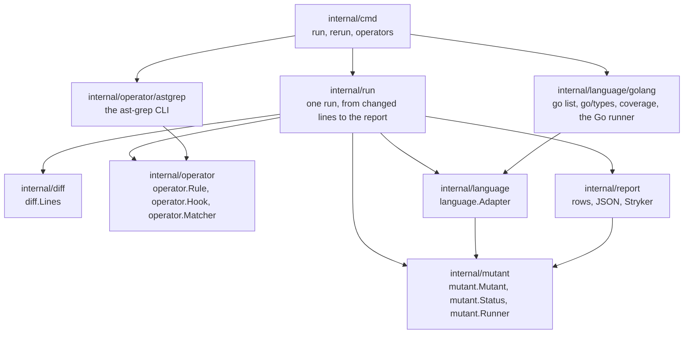

# Design

`mutants` finds weak tests in the lines that a branch changes. It makes one small change to the code at a
time, a mutant, and runs the tests after each one. When the tests still pass, the mutant lives, and that
shows a behaviour that no test pins.

Go is the first language. ast-grep finds the code to change, and `mutants` runs the tests and reports the
result. The design keeps the language out of the core, so that a second language needs a rule pack and a
runner, and no change to the core.

## What it must do

Each requirement comes from a fault that a measurement of five Go mutation tools found on a large Go
monorepo (1,652 packages): gremlins, mutago, gomutants, mutest and togi.

| Requirement | The fault that it prevents |
| --- | --- |
| Mutate only the lines that the branch changes. | On whole packages, 138 of 143 survivors were in code that the branch did not change. |
| Read the diff with fixed prefixes. | With `diff.mnemonicPrefix` set, git prints `+++ w/<path>`. gomutants, mutago and togi then found no changed line, and each reported a clean result with exit 0. |
| Count uncommitted and untracked lines. | The build step of a flow runs before the commit. togi reads only `<base>..HEAD`, and no tool reads untracked files. |
| Never write into the work tree or the index. | gomutants, mutago and togi left report or lock files in the project root. mewt and universalmutator write each mutant into the real file. |
| Find each package with `go list`. | gremlins matches the folder name to the package name. Where they differ, it ran the wrong package and reported every mutant as killed. That was 31 % of the packages. |
| Keep a test failure, a build failure, a timeout and a host failure apart. | mutago and gremlins count every exit code 1 as a kill, and both reported false kills. |
| Run each mutant fresh. | mutago lets Go's test cache answer, and its first and second runs gave different verdicts. |
| Stop the whole process group at the limit, and set the limit from a baseline. | gremlins left a test process alive. togi waits a fixed 30 s, so a small module with hangs took 132 s, against 42 s with a limit from a baseline. |
| Test every mutant by default. | togi tests 20 mutants by default, and it took a sample of 20 from 107. |
| Make the mutants that no tool makes. | No measured tool swaps two values of the same type, or stops a loop after its first item. Both shapes hid real test gaps. |
| Run one mutant again, with clear exit codes. | An agent or a reviewer checks one survivor at a time, after a new test. |
| Give the same verdicts in two runs. | gomutants did, in 4 of 4 pairs. mutago did not, in 0 of 3. |

## Where it runs

`mutants` is a command. An implementation flow calls it at two points, and a reviewer calls it to check one
survivor.



- **In the build step**, `--base HEAD` covers the uncommitted lines of the open task.
- **In the audit**, `--base` is the merge base of the branch, so the run covers the whole branch.
- **`rerun` exits 10 when the mutant lives** and 0 when a test kills it. So the refuter gets a verdict from the
  exit code, and needs no judgement.

## How a run works

```mermaid
flowchart LR
    subgraph FIND["1. find the mutants"]
        direction TB
        A["changed lines<br/>git diff --merge-base, untracked files"] --> C["ast-grep scan<br/>all rules, all changed files"]
        C --> E["keep the edits on changed lines"]
        E --> F["filters<br/>Go: go/types"]
        F --> G["mutants with ids"]
    end
    subgraph RUN["2. run them"]
        direction TB
        H["coverage of each package<br/>NOT COVERED without a test run"] --> I["workers"]
        I --> J["runner<br/>Go: overlay build, then the test binary"]
        J --> K["status of each mutant"]
    end
    subgraph OUT["3. report"]
        direction TB
        L["rows, JSON, Stryker"] --> X["exit code"]
    end
    G --> H
    K --> L
    class A,E,G,I,K,L,X core
    class C astg
    class F,H,J lang
    classDef core stroke:#4a6fd1,stroke-width:3px
    classDef astg stroke:#3f9a55,stroke-width:3px
    classDef lang stroke:#d07a2d,stroke-width:3px
```



A blue border marks a step of the core. A green border marks ast-grep. An orange border marks a step that comes from the adapter of the language.

1. **Changed lines.** `mutants` asks git for the changed lines (see [Changed lines](#changed-lines)).
2. **Candidates.** One ast-grep call scans the changed files with every rule. Each match is a candidate edit,
   with byte offsets and the replacement text.
3. **Scope.** It keeps a candidate only when the edit touches a changed line.
4. **Filters.** The language adapter drops a candidate that cannot build or that changes nothing. For Go,
   `go/types` drops a swap of two values of different types.
5. **Ids.** Each mutant gets an id that stays the same when other code moves (see [Mutant ids](#mutant-ids)).
6. **Coverage.** One coverage run for each package marks the mutants on lines that no test runs. Those
   mutants are NOT COVERED, and they do not run.
7. **Run.** The workers give each mutant to the runner of its language. The runner returns a status.
8. **Report.** It prints the rows, writes the files that the user asks for, and sets the exit code.

### Changed lines

```sh
git -c core.quotePath=false diff --merge-base <base> --unified=0 --no-color --no-ext-diff \
    --src-prefix=a/ --dst-prefix=b/ -- <supported extensions>
git ls-files --others --exclude-standard -- <supported extensions>
```

- **`--src-prefix` and `--dst-prefix` fix the prefixes**, so `diff.mnemonicPrefix` and `diff.noprefix` in a
  user config change nothing.
- **`--merge-base`** compares the work tree with the point where the branch left `<base>`. So it reads
  uncommitted lines, and it ignores commits that landed on `<base>` later.
- **Every line of an untracked file counts as changed.** `mutants` reads the list of untracked files. It does
  not add them to the index.
- **The default base** is the merge base of `HEAD` and `origin/HEAD`. `--base` sets it.

When the changed files give no mutant, `mutants` says so in one line. That line shows a diff that is empty by
mistake.

### Operators

An operator is one kind of change, for example "replace `<` with `<=`". A rule is one ast-grep rule with a
`fix`. An operator has one or more rules, or a hook in Go when a rule cannot express it.

```yaml
# operators/go/CONDITIONALS_BOUNDARY.yml
id: CONDITIONALS_BOUNDARY/lt
language: go
rule:
  pattern: $A < $B
fix: $A <= $B
---
id: CONDITIONALS_BOUNDARY/gt
language: go
rule:
  pattern: $A > $B
fix: $A >= $B
```

```yaml
# operators/go/BREAK_AT_END.yml
id: BREAK_AT_END
language: go
rule:
  pattern: for $$$HEAD { $$$BODY }
  not:
    has:
      field: body
      has:
        kind: statement_list
        has:
          any:
            - kind: return_statement
            - kind: break_statement
            - kind: continue_statement
          nthChild:
            position: 1
            reverse: true
fix: |-
  for $$$HEAD {
  	$$$BODY
  	break
  }
```

The `not` part skips a loop whose last statement is `return`, `break` or `continue`, because a `break` after
it changes nothing. `ast-grep scan --json` returns each match with its `replacement` and its byte offsets, so
one match is one mutant. The rules live in three places, and a later place adds to an earlier one:

| Place | Holds |
| --- | --- |
| `operators/<language>/` in the binary (`go:embed`) | the standard pack |
| `.mutants/operators/<language>/` in the target repository | rules for that repository, for example a shape that its code often gets wrong |
| `--operators` | the operators to run in this call, for example `-ERRORF_WRAP` |

A rule can also carry a filter, so most noise filters are rules too. This rule skips each `+` inside a
zerolog call chain that ends in `Msg` or `Msgf`:

```yaml
id: ARITHMETIC_BASE/plus
language: go
rule:
  pattern: $A + $B
  not:
    inside:
      stopBy: end
      kind: call_expression
      has:
        field: function
        regex: \.Msgf?$
fix: $A - $B
```

A hook is Go code for an operator that needs more than one match. `SWAP_FIELDS` is a hook: a rule can swap
the two fields of a literal with exactly two fields, but not each adjacent pair of a longer literal.

```go
package operator

// Hook makes the edits of an operator from the matches of its rule.
type Hook interface {
	Operator() string
	Edits(source []byte, matches []Match) []Edit
}
```

The Go pack for v1:

| Operator | Change | Notes |
| --- | --- | --- |
| `CONDITIONALS_BOUNDARY` | `<` to `<=`, `>` to `>=`, and back | |
| `CONDITIONALS_NEGATION` | `==` to `!=`, `<` to `>=`, and the rest | |
| `ARITHMETIC_BASE` | `+` to `-`, `*` to `/`, `%` to `*` | |
| `INCREMENT_DECREMENT` | `++` to `--` | |
| `INVERT_LOGICAL` | `&&` to `\|\|` | |
| `REMOVE_LOGICAL_NOT` | `!x` to `x` | |
| `EXPRESSION_REMOVE` | `a && b` to `true && b` | |
| `BRANCH_IF`, `BRANCH_ELSE`, `BRANCH_CASE` | empty the body | finds an error branch that no test enters |
| `STATEMENT_REMOVE` | `x = expr` to `_ = expr`, and removes a call that stands alone, such as `close(done)` or `wg.Done()` | skips a log call that ends in `Msg`, `Msgf` or `Send`, and `panic` |
| `RETURN_ZERO` | a return value to the zero value of its type | the type comes from `go/types` |
| `RETURN_ERROR_NIL` | an error return value to `nil` | `go/types` finds the error slot |
| `RETURN_TRUE` | a bool return value to `true` | `go/types` finds the bool slot; `RETURN_ZERO` already makes it `false` |
| `INTEGER_INCREMENT`, `INTEGER_DECREMENT` | `n` to `n+1`, `n-1` | |
| `RANGE_BREAK` | `break` at the start of a `range` body | |
| `BREAK_AT_END` | `break` at the end of a `for` body | a loop that keeps only its first item |
| `SWAP_FIELDS` | swap the values of two adjacent keyed fields of the same type | a hook; two equal figures hide a swap |
| `ERRORF_WRAP` | `%w` to `%v` | off by default: on two measured commits it made 3 of 5 survivors, and no caller unwrapped those errors |

### Filters

A filter drops a candidate before it costs a build. The Go adapter has three:

| Filter | Drops |
| --- | --- |
| Type | a `SWAP_FIELDS` pair whose two values do not have identical types in `go/types` |
| Same text | an edit whose replacement is the same as the original |
| Generated code | a file with the `// Code generated ... DO NOT EDIT.` line |

A candidate that passes the filters and still fails to build is NOT VIABLE.

### Mutant ids

```text
<file from the repository root>:<function>:<operator>#<n>
internal/order/handler.go:(*Handler).accounts:BRANCH_IF#1
```

- **The function** comes from the adapter. For Go, it is the receiver and the name of the `FuncDecl` that
  holds the edit.
- **`n`** counts the mutants of that operator in that function, in source order.

So an edit in another function does not change the id. An id with a line number changes each time the code
above it moves, so a survivor from the build step does not match a row in the audit.

### The Go runner

The runner builds the test binary with an overlay, and then runs the binary itself. It never runs `go test`
on a mutant.



- **No write to the work tree.** The mutated file and the overlay file stay in a temp folder. `-overlay`
  makes the build read the mutated file in place of the real one.
- **No test cache.** The runner runs the binary itself, so Go's test cache never gives a result.
- **A clean split.** A build failure comes from `go test -c`, and a test failure comes from the binary. The
  runner does not read `[build failed]` out of mixed output.
- **The package folder.** The binary runs in the package folder, as `go test` does, so a test can read its
  `testdata`.
- **Build tags.** `--tags` goes to `go list`, to the coverage run and to `go test -c`.

### Statuses



| Status | Meaning | Counts as a survivor |
| --- | --- | --- |
| KILLED | a test failed | no |
| LIVED | every test passed | yes |
| NOT COVERED | no test runs the line | yes |
| NOT VIABLE | the mutant does not build | no |
| TIMED OUT | the tests ran past the limit | no |
| INFRA ERROR | the host stopped the run, for example out of memory | no |

Go's coverage profile has no block for the part of a statement that comes after a function literal. A tool
that reads "no block" as "not covered" never runs the mutants on those lines. So `mutants` marks a mutant
NOT COVERED only when a block with a count of 0 holds it. A mutant that no block holds runs.

### Time limits

| Limit | Value |
| --- | --- |
| The build of one mutant | 120 s, or `--build-limit` |
| The test run of one mutant | the baseline test time of its package × 3, at least 2 s |
| The whole run | `--limit`, none by default |

`mutants` measures the baseline once for each package, with the real code, before the first mutant. A
package whose baseline fails stops the run with exit 2: a red suite gives no verdict.

At the `--limit` of the whole run, `mutants` stops the workers, writes the rows that it has, and exits 124.

### Workers

| Setting | Default | Notes |
| --- | --- | --- |
| `--workers` | 4 | one mutant at a time for each worker |
| `-p` in `GOFLAGS` | 2 | for each build, unless the user sets `GOFLAGS` |
| `GOMAXPROCS` of a test binary | CPUs ÷ workers | so the test binaries do not use all the CPUs at once |

The workers sort the mutants by package and file. The first mutant of a package pays for the cold build, and
the next mutants reuse the build cache.

## Commands

| Command | Does | Exit |
| --- | --- | --- |
| `mutants run` | runs the mutants of the changed lines | 0 no survivor, 10 survivors, 124 the limit, 2 a usage or tool error |
| `mutants run --all PATH...` | runs the mutants of whole packages | same |
| `mutants rerun ID` | runs one mutant again, with no cache | 0 killed, 10 lived, 1 no verdict, 2 an unknown id |
| `mutants operators` | lists the operators and their rules | 0 |
| `mutants version`, `mutants update` | as now | |

The flags of `run`: `--base`, `--workers`, `--limit`, `--build-limit`, `--tags`, `--operators`,
`--format rows|json`, `--json PATH`, `--stryker PATH`.

## Output

The rows are for a person or an agent. Each row is one mutant, grouped by status:

```text
LIVED:
  internal/order/handler.go:42 BRANCH_IF: { return nil, fmt.Errorf("load the accounts ... -> { _ = 0 }  [internal/order/handler.go:(*Handler).accounts:BRANCH_IF#1]
NOT COVERED:
  internal/order/handler.go:43 RETURN_ERROR_NIL: fmt.Errorf("load the accounts ... -> nil  [internal/order/handler.go:(*Handler).accounts:RETURN_ERROR_NIL#1]
mutants: 81, killed: 64, lived: 1, not covered: 3, not viable: 13 (base 1a2b3c4d5e)
```

`--format json` prints the same mutants as one JSON document, with the fields `id`, `file`, `line`,
`column`, `operator`, `status`, `original` and `replacement`. `--stryker` writes the
`mutation-testing-elements` report format, which has an HTML viewer and does not depend on the language.

## Config

A repository can keep its settings in `.mutants.yml`. A flag wins over the file.

```yaml
base: origin/main
workers: 4
tags: [unit]
operators: [-ERRORF_WRAP]
exclude: ["**/*_gen.go", "vendor/**"]
```

The cache and the state files go under `$(git rev-parse --git-dir)/mutants/`, so the work tree stays clean.

## Packages



An arrow means "imports". `cmd` gives the ast-grep matcher and the Go adapter to `run`, so `run` knows only
the interfaces.

| Package | Holds |
| --- | --- |
| `diff` | `diff.Lines`, the changed lines of each file, and the git calls that read them |
| `operator` | the rule packs, `operator.Rule`, `operator.Hook`, `operator.Matcher`, and the hooks |
| `operator/astgrep` | an `operator.Matcher` that calls `ast-grep scan --json` and parses its matches |
| `mutant` | `mutant.Mutant`, `mutant.Status`, `mutant.Runner`, and the id |
| `language` | `language.Adapter`: the files it supports, its filters, the function that holds an offset, its coverage and its runner |
| `language/golang` | the Go adapter |
| `run` | one run: changed lines, candidates, filters, coverage, workers and the report |
| `report` | the rows, the JSON and the Stryker format |

```go
package language

// Adapter is everything that the core needs from one language.
type Adapter interface {
	Extensions() []string
	Keep(candidate operator.Edit) bool
	Function(file string, offset int) string
	Uncovered(ctx context.Context, files []string) (diff.Lines, error)
	Runner() mutant.Runner
}
```

ast-grep is a separate binary. mise pins its version beside the other tools, and `mutants` checks the
version when it starts.

## Tests of the tool

| Level | What it checks |
| --- | --- |
| Unit (`-tags=unit`) | the parse of a diff with each prefix setting, the scope of edits, the ids, the filters, the status of each exit, each rule against a small Go source |
| End to end (`e2e/`) | the binary against small Go modules in git repositories that the tests make, with known answers |
| Acceptance | a real branch with known test gaps, two runs, compared mutant by mutant |

The end-to-end fixtures:

| Fixture | Expected |
| --- | --- |
| Two figures of one type with equal values in the test | `SWAP_FIELDS` LIVED. With different values in the test: KILLED. |
| An error branch that no test enters | `BRANCH_IF` LIVED and `RETURN_ERROR_NIL` NOT COVERED |
| A loop over a list that a test runs with one item | `BREAK_AT_END` LIVED. With two items: KILLED. |
| A busy loop and a removed `close` | TIMED OUT, no test process alive after the run |
| `diff.mnemonicPrefix=true` in the git config of the fixture | the same mutants as without it |
| An untracked new file | its mutants run, and `git status` is the same after the run |
| A folder name that differs from its package name | the mutants run the tests of that package |
| A test file with a build tag | with `--tags`, its tests run |
| Two runs | the same verdicts, mutant by mutant |

## Later

| Version | Adds |
| --- | --- |
| v2 | **Test selection by coverage.** A map from each line to the tests that run it, so a mutant runs only those tests. This was the main speed gain of gomutants. |
| v2 | **A cache.** A verdict keyed by a hash of the package files, the test files, the rules and the `mutants` version, so a second run reuses it. |
| v3 | **TypeScript.** A rule pack, and a runner that writes each mutant into a git worktree for each worker, in a temp folder, and runs `vitest related <file> --run`. |
| v3 | Other languages that ast-grep parses: the same shape, a rule pack and a runner. |

## Decisions

**Why ast-grep rather than tree-sitter.** ast-grep is tree-sitter plus a pattern language, a rewriter and the
grammars. With tree-sitter alone, `mutants` has to build those three again. The rules then stay data that a
user can add to without a new release.

**Why the ast-grep CLI rather than a library.** ast-grep has no Go binding. One call returns all the matches
as JSON, and the parse takes much less time than one test run.

**Why `mutants` starts ast-grep rather than read its matches from a pipe.** With a pipe, an ast-grep that
fails gives empty input. Unless the shell has `pipefail` on, the pipe returns exit 0, and `mutants` reports a
clean result for 0 mutants. That is the same fault as a diff with the wrong prefix. When `mutants` starts
ast-grep, it reads the exit code, stderr and the version. A pipe also leaves the hard parts to the caller: the
changed files, and the rule packs that live in the binary.

A pipe does not remove the tie to ast-grep. `mutants` still parses the JSON of ast-grep, because the hooks,
the filters and the ids take matches as input. With a pipe, `rerun ID` needs the user to repeat the exact
ast-grep call, and an implementation flow gets two commands and two exit codes. A unit test gives `run` a fake
`operator.Matcher` with fixed matches, so a test of the core needs no ast-grep. Another generator, for example
comby, is a second `operator.Matcher`.

**Why the binary rather than `go test`.** The binary gives a test failure and a build failure from two
different commands, and Go's test cache never answers.

**Why the whole package in v1 rather than the tests that cover a line.** A run of the whole package gives a
correct verdict with no map. For a branch of about 100 mutants, it takes about 1 to 2 minutes with 4 workers.
The map comes in v2, for speed.

**Why read untracked files rather than add them to the index.** A change to the index can stay behind when a
run stops halfway, and the user then sees files that they did not stage.
