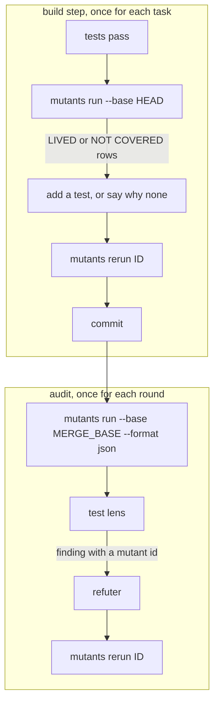
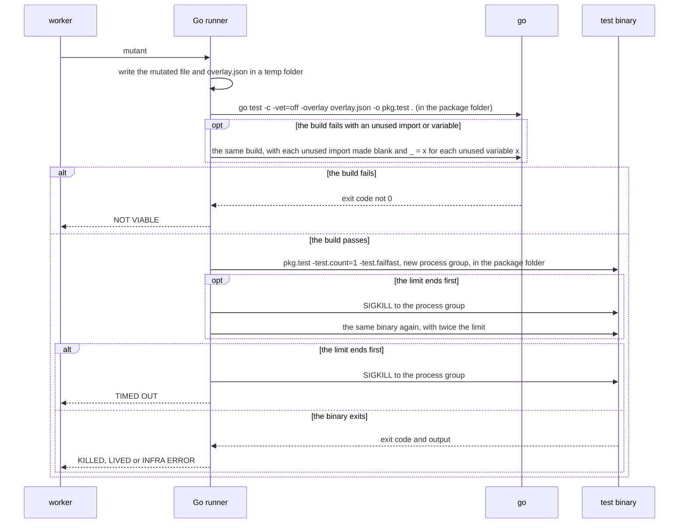
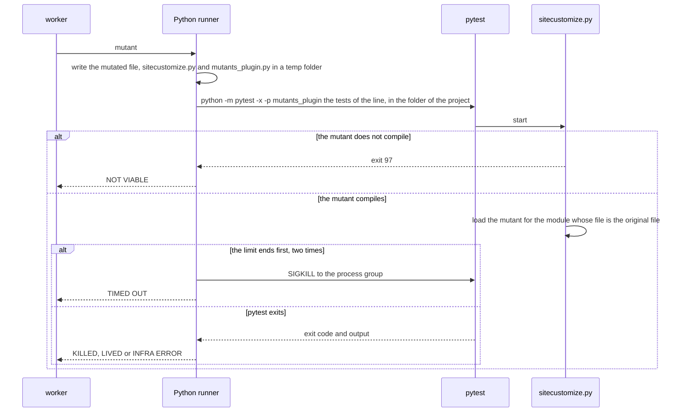
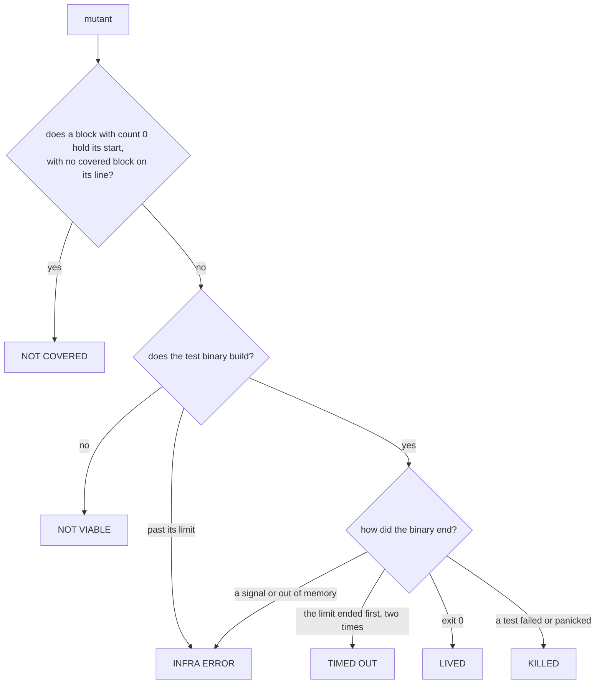
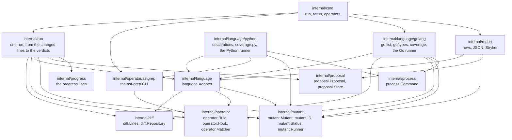

# Design

`mutants` finds weak tests in the lines that a branch changes. It makes one small change to the code at a
time, a mutant, and runs the tests after each one. When the tests still pass, the mutant lives, and that
shows a behaviour that no test pins.

Go is the first language, and Python is the second. ast-grep finds the code to change, and `mutants` runs the
tests and reports the result. The design keeps the language out of the core, so that a new language needs a
rule pack and a language adapter, and no change to the core. [docs/language-adapters.md](language-adapters.md) tells how to
add one.

## What it must do

Each requirement comes from a fault that a measurement of five Go mutation tools found on a large Go
monorepo (1,652 packages): gremlins, mutago, gomutants, mutest and togi.

| Requirement | The fault that it prevents |
| --- | --- |
| Mutate only the lines that the branch changes. | On whole packages, 138 of 143 survivors were in code that the branch did not change. |
| Read the diff with fixed prefixes. | With `diff.mnemonicPrefix` set, git prints `+++ w/<path>`. gomutants, mutago and togi then found no changed line, and each reported a clean result with exit 0. |
| Count uncommitted and untracked lines. | The build step of a flow runs before the commit. togi reads only `<base>..HEAD`, and no tool reads untracked files. |
| Never write into the work tree or the index. | gomutants, mutago and togi left report or lock files in the project root. mewt and universalmutator write each mutant into the real file. |
| Find each package with `go list`. | gremlins matches the folder name to the package name. Where they differ, it ran the wrong package and reported every mutant as killed. That was 31 % of the packages. |
| Keep a test failure, a build failure, a timeout and a host failure apart. | mutago and gremlins count every exit code 1 as a kill, and both reported false kills. |
| Run each mutant fresh. | mutago lets Go's test cache answer, and its first and second runs gave different verdicts. |
| Stop the whole process group at the limit, and set the limit from a baseline. | gremlins left a test process alive. togi waits a fixed 30 s, so a small module with hangs took 132 s, against 42 s with a limit from a baseline. |
| Test every mutant by default. | togi tests 20 mutants by default, and it took a sample of 20 from 107. |
| Make the mutants that no tool makes. | No measured tool swaps two values of the same type, or stops a loop after its first item. Both shapes hid real test gaps. |
| Run one mutant again, with clear exit codes. | An agent or a reviewer checks one survivor at a time, after a new test. |
| Give the same verdicts in two runs. | gomutants did, in 4 of 4 pairs. mutago did not, in 0 of 3. |

## Where it runs

`mutants` is a command. An implementation flow calls it at two points, and a reviewer calls it to check one
survivor.



- **In the build step**, `--base HEAD` covers the uncommitted lines of the open task.
- **In the audit**, `--base` is the merge base of the branch, so the run covers the whole branch.
- **`rerun` exits 10 when the mutant lives** and 0 when a test kills it. So the refuter gets a verdict from the
  exit code, and needs no judgement.

## How a run works

```mermaid
flowchart LR
    subgraph FIND["1. find the mutants"]
        direction TB
        A["changed lines<br/>git diff --merge-base, untracked files"] --> C["ast-grep scan<br/>all rules, all changed files"]
        C --> F["filters<br/>Go: go/types"]
        F --> G["ids"]
        G --> E["keep the mutants on changed lines"]
        P["proposals<br/>with --proposals"] --> E
    end
    subgraph RUN["2. run them"]
        direction TB
        CG["caller gaps<br/>with --caller-gaps"] --> H["coverage of each package<br/>NOT COVERED without a test run"]
        H --> I["workers"]
        I --> J["runner<br/>Go: overlay build, then the test binary"]
        J --> K["status of each mutant"]
    end
    subgraph OUT["3. report"]
        direction TB
        L["rows, JSON, Stryker"] --> X["exit code"]
    end
    E --> CG
    K --> L
    class A,E,G,I,K,L,X,P core
    class C astg
    class F,H,J,CG lang
    classDef core stroke:#4a6fd1,stroke-width:3px
    classDef astg stroke:#3f9a55,stroke-width:3px
    classDef lang stroke:#d07a2d,stroke-width:3px
```



A blue border marks a step of the core. A green border marks ast-grep. An orange border marks a step that comes from the adapter of the language.

1. **Changed lines.** `mutants` asks git for the changed lines of the files that an adapter takes (see
   [Changed lines](#changed-lines)). Each file goes to the adapter whose extensions hold the extension of the
   file, so one run tests each language that the diff changes.
2. **Candidates.** For each language, one ast-grep call scans its changed files with the rules of its pack. Each
   match is a candidate edit, with byte offsets and the replacement text.
3. **Filters.** The language adapter drops a candidate that cannot build or that changes nothing (see
   [Filters](#filters)).
4. **Ids.** Each candidate in the changed files gets an id that stays the same when other code moves (see
   [Mutant ids](#mutant-ids)).
5. **Scope.** It keeps a mutant only when its edit touches a changed line.
6. **Proposals.** With `--proposals`, each proposal becomes a mutant, or the run rejects it with a reason
   (see [Proposed mutants](#proposed-mutants)).
7. **Caller gaps.** With `--caller-gaps`, the adapter finds the changed lines that no test of a changed caller
   runs (see [Caller gaps](#caller-gaps)).
8. **Coverage.** The adapter of each language gets the mutants of its files. One coverage run for each package
   marks the mutants that no test runs. Those mutants are NOT COVERED, and they do not run.
9. **Run.** The workers give each mutant to the runner of its language. The runner returns a status.
10. **Report.** It prints the rows, writes the files that the user asks for, and sets the exit code.

### Changed lines

```sh
git -c core.quotePath=false diff --merge-base <base> --unified=0 --inter-hunk-context=0 \
    --no-color --no-ext-diff --no-textconv --no-relative --find-renames \
    --src-prefix=a/ --dst-prefix=b/ -- ':(glob)**/*.go' ':(glob,exclude)<exclude>'...
git ls-files --others --exclude-standard -z -- ':(glob)**/*.go' ':(glob,exclude)<exclude>'...
```

- **`--src-prefix` and `--dst-prefix` fix the prefixes**, so `diff.mnemonicPrefix` and `diff.noprefix` in a
  user config change nothing. The other flags fix the context, the colour, the diff tool, the text
  conversion, `diff.relative` and the rename detection in the same way.
- **`--merge-base`** compares the work tree with the point where the branch left `<base>`. So it reads
  uncommitted lines, and it ignores commits that landed on `<base>` later.
- **Every line of an untracked file counts as changed.** `mutants` reads the list of untracked files. It does
  not add them to the index.
- **The default base** is the merge base of `HEAD` and `origin/HEAD`. `--base` sets it.
- **A name that git quotes** keeps its name: `mutants` reads the C quotes of git, and the tab that git puts
  after a name with a space.
- **`--all FOLDER...`** reads every line of the files in each folder, tracked or untracked, from
  `git ls-files`. `FOLDER/...` adds the subfolders.

When the changed files give no mutant, `mutants` says so in one line. That line shows a diff that is empty by
mistake:

```text
no mutant: 0 changed lines in 0 files (base 1a2b3c4d5e)
```

### Operators

An operator is one kind of change, for example "replace `<` with `<=`". A rule is one ast-grep rule with a
`fix`. An operator has one or more rules, or a hook in Go when a rule cannot express it.

The catalog in `internal/operator/catalog.go` names each operator, and whether it runs by default. The pack of
each language must give rules for each operator of the catalog, and for no other operator, so an operator is
the same change in each language. A change that only one language can make, such as the `AddDate` of
calendar days in Go, is a rule of a repository.

```yaml
# internal/operator/operators/go/CONDITIONALS_BOUNDARY.yml, two of its eight rules
id: CONDITIONALS_BOUNDARY/lt
language: go
rule:
  pattern: $A < $B
fix: $A <= $B
---
id: CONDITIONALS_BOUNDARY/gt
language: go
rule:
  pattern: $A > $B
fix: $A >= $B
```

```yaml
# internal/operator/operators/go/BREAK_AT_END.yml
id: BREAK_AT_END
language: go
rule:
  pattern: for $$$HEAD { $$$BODY }
  not:
    has:
      field: body
      has:
        kind: statement_list
        has:
          any:
            - kind: return_statement
            - kind: break_statement
            - kind: continue_statement
          nthChild:
            position: 1
            reverse: true
fix: |-
  for $$$HEAD {
  	$$$BODY
  	break
  }
```

The `not` part skips a loop whose last statement is `return`, `break` or `continue`, because a `break` after
it changes nothing. `ast-grep scan --json` returns each match with its `replacement` and its byte offsets, so
one match is one mutant. `mutants` runs the scan with `--hint`, so a rule with `severity: error` does not
change the exit code of ast-grep. The rules live in three places, and a later place adds to an earlier one:

| Place | Holds |
| --- | --- |
| `internal/operator/operators/<language>/` in the binary (`go:embed`) | the standard pack |
| `.mutants/operators/<language>/` in the target repository | rules for that repository, for example a shape that its code often gets wrong. A rule with the id of a standard rule replaces that rule. |
| `--operators` | the operators to run in this call: `-NAME` takes an operator out, `+NAME` adds one, and `NAME` with no sign runs only the named operators. `none` runs no operator, so a run can hold only proposals or only the check for caller gaps. |

A rule with `metadata: {default: off}` runs only when `--operators` names its operator. `mutants operators`
lists each operator, whether it runs by default, and its rules.

A rule can also carry a filter for its own operator, such as the `not` part of `BREAK_AT_END`. Code that no
operator must change, such as a log call, has a skip rule: an ast-grep rule with no `fix`, in
`internal/operator/skip/<language>/`. The scan runs the skip rules together with the rules of the operators.
`mutants` then drops each edit inside a match of a skip rule. It also drops each edit that changes only the
code of such matches: the text of the edit has no letter and no digit outside them, for example a block that
holds only log calls. This skip rule matches a zerolog call chain that ends in `Msg`, `Msgf` or `Send`. `\s*`
finds a chain over more than one line, where white space comes between the dot and `Msg`. A repository adds
its own skip rules in `.mutants/skip/<language>/`, and a skip rule with the id of a standard skip rule
replaces that rule.

```yaml
# internal/operator/skip/go/zerolog.yml
id: zerolog
language: go
rule:
  kind: call_expression
  has:
    field: function
    regex: \.\s*(Msgf?|Send)$
```

A hook is Go code for an operator that needs more than one match. `NAMED_VALUE_SWAP` is a hook: a rule can
swap the two fields of a literal with exactly two fields, but not each adjacent pair of a longer literal.

```go
package operator

// Hook makes the edits of an operator from the matches of its rules in one file.
type Hook interface {
	Operator() string
	Edits(source []byte, matches []Match) []Edit
}
```

A rule cannot know a type, so a rule gives every candidate and the type filter of the adapter chooses.
`RETURN_EMPTY` has one rule for each zero value (`nil`, `0`, `""` and `false`) and one rule that makes a
struct literal `T{}`, and the filter keeps the one that is the zero value of the slot. `ARGUMENT_EMPTY` does
the same for the parameter of a call argument.

The Go pack for v1:

| Operator | Change | Notes |
| --- | --- | --- |
| `CONDITIONALS_BOUNDARY` | `<` to `<=`, `>` to `>=`, `a.After(b)` to `!a.Before(b)`, `a.Before(b)` to `!a.After(b)`, and back | Go compares two `time.Time` values with `After` and `Before`, and each pair differs only when the two times are equal |
| `CONDITIONALS_NEGATION` | `==` to `!=`, `<` to `>=`, and the rest | |
| `ARITHMETIC_BASE` | `+` to `-`, `-` to `+`, `*` to `/`, `/` to `*`, `%` to `*` | |
| `INCREMENT_DECREMENT` | `++` to `--`, and back | |
| `INVERT_LOGICAL` | `&&` to `\|\|`, and back | |
| `REMOVE_LOGICAL_NOT` | `!x` to `x` | |
| `EXPRESSION_REMOVE` | `a && b` to `true && b` and to `a && true`, `a \|\| b` to `false \|\| b` and to `a \|\| false` | |
| `BRANCH_IF`, `BRANCH_ELSE`, `BRANCH_CASE` | the body of an `if` or an `else` to `{}`, and no statement in a `case` | finds an error branch that no test enters |
| `STATEMENT_REMOVE` | `x = expr` to `_ = expr`, and removes a call that stands alone, such as `close(done)` or `wg.Done()` | skips `panic` |
| `RETURN_EMPTY` | a return value to the zero value of its type, and a struct literal `T{…}` to `T{}` | the type comes from `go/types` |
| `ERROR_REMOVE` | an error return value to `nil` | `go/types` finds the error slot |
| `RETURN_TRUE` | a bool return value to `true` | `go/types` finds the bool slot; `RETURN_EMPTY` already makes it `false` |
| `INTEGER_INCREMENT`, `INTEGER_DECREMENT` | `n` to `(n+1)`, `(n-1)` | |
| `BREAK_AT_START` | `break` at the start of a `range` body | |
| `BREAK_AT_END` | `break` at the end of a `for` body | a loop that keeps only its first item |
| `NAMED_VALUE_SWAP` | swap the values of two adjacent keyed fields of the same type | a hook; two equal figures hide a swap |
| `NAMED_VALUE_REMOVE` | removes one keyed field from a struct literal, so the field gets the zero value of its type | shows a field that no test reads |
| `ARGUMENT_EMPTY` | a call argument to the zero value of its parameter type | off by default: each argument of each call makes a mutant, so it is noisy until it has a filter |
| `ERROR_CAUSE_REMOVE` | `%w` to `%v` | off by default: on two measured commits it made 3 of 5 survivors, and no caller unwrapped those errors |

### Filters

A filter drops a candidate before it costs a build. The Go adapter has these:

| Filter | Drops |
| --- | --- |
| Same text | an edit whose replacement is the same as the original |
| Test file | an edit in a `_test.go` file |
| Generated code | a file with the `// Code generated ... DO NOT EDIT.` line |
| Build tags | an edit in a file that `go list` leaves out of its package with the build tags of the run |
| Type | a `NAMED_VALUE_SWAP` pair outside a struct literal, or whose two values do not have identical types in `go/types` |
| Table | a `NAMED_VALUE_SWAP` pair in a table of named values, where each value is a literal of one named type with constant fields, such as `NoMatch: Reason{"NoMatch"}`. A swap there lives unless a test reads the text. |
| Type | a `RETURN_EMPTY` value that is not the zero value of its slot, that fills an error slot, or that is zero already |
| Type | an `ERROR_REMOVE` value that does not fill an error slot, and a `RETURN_TRUE` value that does not fill a bool slot or is `true` already |
| Negative index | an `INTEGER_DECREMENT` of a literal `0` in an index, a slice bound or a size for `make` |
| Type | a `NAMED_VALUE_REMOVE` field outside a struct literal, or whose value is zero already |
| Type | an `ARGUMENT_EMPTY` value that is not the zero value of its parameter, that fills an error parameter, or that is zero already, and an argument of a builtin, of a conversion or of a variadic parameter. Also a `context.Context`, and the constant text of a call whose only result is an error, such as `errors.New` or `fmt.Errorf`. |
| Type | a `CONDITIONALS_BOUNDARY` edit of `After` or `Before` of a method that `go/types` does not find on `time.Time` |

The Python adapter has these:

| Filter | Drops |
| --- | --- |
| Same text | an edit whose replacement is the same as the original |
| Return type | a `RETURN_EMPTY` value that does not fit the return type of its function: `0` for `int` or `float`, `""` for `str`, `False` for `bool`, `[]` for a list or a sequence, `{}` for a dict or a mapping, and `None` for each other type and for a function with no return type |
| Return type | a `RETURN_TRUE` value that is not a comparison, a `not` or `False`, in a function whose return type is not `bool` |
| No value before | a `STATEMENT_REMOVE` of `x = e` when `x` has no value before the statement in its function: no parameter, no earlier assignment, no `for` or `with` target, and no `global` or `nonlocal`. The next read of `x` then raises `NameError`. |

The skip rules of Python drop the edits in the test files, in the generated files, in the calls of a logger,
in the type annotations and in the `if TYPE_CHECKING:` blocks.

A candidate that passes the filters and still fails to build is NOT VIABLE.

### Mutant ids

```text
<file from the repository root>:<function>:<operator>#<n>
internal/order/handler.go:(*Handler).accounts:BRANCH_IF#1
```

- **The function** comes from the adapter. For Go, it is the receiver and the name of the `FuncDecl` that
  holds the edit: `(*Handler).accounts`, `Handler.name` or `total`. A generic receiver drops its type
  parameters. Outside a function, it is the name of the declaration, for example a package variable.
- **`n`** counts the mutants of that operator in that function, in source order. It counts after the
  filters and before the scope, so `n` does not depend on the lines that the diff holds.

So an edit in another function does not change the id, and a mutant has the same id with `--base HEAD` and
with the merge base of the branch. An id with a line number changes each time the code above it moves, so a
survivor from the build step does not match a row in the audit.

### Proposed mutants

An operator cannot make a bug of the domain, for example a condition that is too narrow for the rule of
the business. An agent that has the task and the diff can propose such a bug. `mutants run --proposals PATH`
reads the proposals of the agent from a file, one JSON object on each line:

```json
{"file": "internal/order/wait.go", "old": "waited && !note", "new": "waited && open && !note", "bug": "a note after the deadline no longer stops the close"}
```

| Field | Holds |
| --- | --- |
| `file` | the path of the file from the repository root |
| `old` | the exact text to replace. It must occur once in the file. |
| `new` | the text that takes its place, or `""` to remove `old` |
| `bug` | the bug that the edit puts in the code, in one sentence |
| `ref` | optional: a text that the JSON report gives back on the mutant, so a tool can match each result to its source, for example a review finding |

`mutants` turns each proposal into a mutant with the operator `PROPOSED`, and runs it with the same runner,
the same retry after an unused import or variable, and the same statuses. A proposal that cannot become a
mutant is rejected with its reason:

| Reason | When |
| --- | --- |
| the file is not in the repository | `file` is an absolute path, or goes above the root |
| the go adapter does not take this file | the file is not a `.go` file |
| the file does not exist | no file has that path |
| old not found, old found N times | `old` does not occur exactly once |
| old and new are the same | the edit changes nothing |
| the go adapter drops the edit | the file is a test file, generated code, or out of the build |
| not on a changed line | the edit does not touch a changed line, and the run has no `--proposals-anywhere` |

- **The id** is `<file>:<function>:PROPOSED#<n>`. `n` has six digits from a hash of `old` and `new`, so an
  edit keeps its id when the agent proposes a different set of other edits.
- **The same edit.** Proposals with the same edit have the same id, so they make one mutant. Each of them
  counts as accepted, and the mutant carries the `ref` of each, so no source of a proposal loses its verdict.
- **The store.** The run saves each accepted proposal in
  `$(git rev-parse --absolute-git-dir)/mutants/proposals.jsonl`, so `rerun ID` finds a proposed mutant
  without the file. A linked work tree has a git folder, and so a store, of its own.
- **A stale proposal.** When `old` does not occur once in the file any more, `rerun` exits 1 and says that
  the proposal does not fit the code.
- **No silent clean result.** A file that cannot be read, a line that is not a proposal, and a file with no
  proposal stop the run with exit 2. The rows list each rejected proposal with its reason, and a last line
  counts the accepted and the rejected proposals.

On two reviewed commits of the measured monorepo, two agents read only the code and the diff, and each
proposed 8 mutants. On one commit 4 of 8 lived, and on the other 8 of 8 lived. Each commit had one survivor
that a reviewer found by hand, and that no operator makes.

### Caller gaps

A change can wire new code of one package into another changed package, while the tests of the caller use a
fake for that code. No test then runs the new code from the caller. The tests of the new package kill each
mutant there, so no mutant shows the gap. On a measured PR, two reactors wired in a new gate, and a reviewer
found that no reactor test reached it.

With `--caller-gaps`, or `caller_gaps: true` in `.mutants.yml`, the run looks for these gaps:

1. **Callers.** A caller is a changed package that imports another changed package, its callee. `go/types`
   gives the imports.
2. **Reach.** The check follows each function of the callee that a changed line of the caller calls, then
   each function that those functions call. It also follows the methods of a type that a reached function
   returns, or builds with a composite literal. So a constructor that a changed line calls reaches each
   method of the value that it returns. A changed line that calls only an interface of the caller reaches
   nothing, so a caller whose tests use a fake gives no gap.
3. **One test run for each caller.** The tests of the caller run once with `-coverpkg` on its callees.
4. **Gaps.** A caller gap is a changed line of a reached function, where a statement starts, that the tests
   of its own package run but that the tests of no caller that reaches the function run. The check takes
   the line where a statement starts, because Go 1.26 starts a coverage block on the line of the brace
   before the statement, and Go 1.27 starts it on the statement.

The rows list each gap apart from the statuses of the mutants, by function:

```text
CALLER GAPS:
  common/modules/informationsufficiency/checker.go:102-104,106 (*Checker).closingItemArrived, not run by the tests of collect/handler/CustomerCaseRequestInformation, collect/handler/EmailConversationRecordInformation
mutants: 81, killed: 64, lived: 1, not covered: 3, not viable: 13 (base 1a2b3c4d5e)
caller gaps: 1
```

A run that finds a caller gap exits 10, as a run with a survivor does. The check costs one more test run for
each caller. It is off by default until its noise is measured on more PRs.

### The Go runner

The runner builds the test binary with an overlay, and then runs the binary itself. It never runs `go test`
on a mutant.



- **No write to the work tree.** The mutated file and the overlay file stay in a temp folder. `-overlay`
  makes the build read the mutated file in place of the real one.
- **No test cache.** The runner runs the binary itself, so Go's test cache never gives a result.
- **No growth of the build cache.** No later build reads the compiled packages of a mutant, so they must not
  stay in the build cache of the user. The runner sets `GOCACHEPROG` to `mutants build-cache`, which reads
  the cache of the user and writes each new entry to a folder of the mutant. The runner deletes the folder
  after the mutant. Without it, each mutant of `internal/run` adds 1.2 MB, and go keeps an entry for 5 days.
  - A `GOCACHEPROG` of the user stays in place, for example a remote cache in CI.
  - A build whose cache program fails gives INFRA ERROR, not NOT VIABLE.
  - Before Go 1.24, go reads `GOCACHEPROG` only with `GOEXPERIMENT=cacheprog`. Without it, the mutant
    builds write to the cache of the user.
  - The coverage runs write to the cache of the user, because the next run of the same commit reads them.
- **A clean split.** A build failure comes from `go test -c`, and a test failure comes from the binary. The
  runner does not read `[build failed]` out of mixed output.
- **The package folder.** The binary runs in the package folder, as `go test` does, so a test can read its
  `testdata`.
- **Build tags.** `--tags` goes to `go list`, to the coverage run and to `go test -c`.
- **No vet.** `-vet=off` keeps a vet check out of the build, because a vet check is not a build failure.
- **Unused imports and variables.** A mutant that removes the only use of an import, such as the
  `fmt.Errorf` of an error branch, fails with "imported and not used". A mutant that removes the only use
  of a variable, such as `|| !slices.Contains(requested, id)`, fails with "declared and not used". The
  runner then makes each import that the compiler names blank, and adds `_ = x` for each variable `x` that
  it names: after the statement that declares `x`, or at the start of each body whose header declares `x`,
  such as `if v, ok := m[k]; ok {` or `case v := <-c:`. Then it builds one more time. Without this,
  `BRANCH_IF` on an error branch is NOT VIABLE. On 12 measured PRs, 56 of 78 NOT VIABLE mutants failed only
  with "declared and not used", and two of them live when they build.
- **No process stays alive.** Each build and each test binary runs in its own process group. At its limit,
  after it exits, and when `mutants` gets SIGINT or SIGTERM, the runner sends SIGKILL to the whole group.

### The Python runner

The Python runner never writes a mutant to the work tree. It writes the mutated file into a temp folder,
together with two Python files that the binary holds: `sitecustomize.py`, an import hook, and
`mutants_plugin.py`, a pytest plugin. The temp folder comes first in `PYTHONPATH`, so each Python process
of the tests loads the hook when it starts, also a process that a test starts.



- **The project.** The project of a file is the nearest folder above it with `pyproject.toml`, `setup.cfg`,
  `setup.py`, `pytest.ini` or `tox.ini`, or else the root of the repository. pytest runs in the folder of the
  project, with the Python of the project: `python.command` of `.mutants.yml`, or `.venv/bin/python` of the
  project, or `python3`.
- **No write to the work tree.** The hook reads the mutant from the temp folder, and the module keeps the
  original file as its `__file__`. `PYTHONDONTWRITEBYTECODE=1` keeps `__pycache__` out, and
  `-p no:cacheprovider` keeps `.pytest_cache` out.
- **Not a worktree.** An editable install, such as `pip install -e .` or `uv sync`, points the imports at the
  folder of the repository. In a copy of the repository in a git worktree, the tests import the real code.
- **Coverage and test selection.** pytest runs one time for each project, with coverage.py and one context
  for each test. For each statement, the coverage gives the node ids of the tests that run it, and a mutant
  runs only those tests. A statement that runs only when its module loads, such as a constant, runs each
  test of the project. coverage.py counts a statement on more than one line at its first line, so the
  runner takes the last statement that starts on or before the line of the mutant.
- **NOT COVERED.** A mutant whose statement no test runs, and each mutant of a file that no test imports. A
  project with no tests gives one row for its mutants. coverage.py measures no child process, so a line
  that runs only in a process that a test starts is NOT COVERED.
- **The sysmon core.** The coverage run sets `COVERAGE_CORE=ctrace`. On Python 3.12 and later, coverage.py
  takes its sysmon core, and that core records no context for each test.
- **pytest-cov.** The plugin turns off pytest-cov, also when `addopts` has `--cov`, because a second tracer
  in the same process takes the lines away from the first.
- **No coverage.py.** A project without coverage.py stops the run with exit 2, and the message tells to add
  `coverage` or `pytest-cov` to its dev dependencies.
- **Statuses.** pytest exits with 0 for LIVED, and with 1, 2, 3 or 4 for KILLED. Exit 2 is an error when
  pytest collects a test module, and exit 4 is an error when it loads a `conftest.py`, such as an import that
  the mutant breaks. pytest also gives 4 for a usage error, but the run with the real code passed with the
  same arguments. Exit 5 is INFRA ERROR. The detail of KILLED is the first `FAILED` or `ERROR` line of the
  summary, or the conftest that failed and its error.
- **No process stays alive.** pytest runs in its own process group, as each test binary of Go does.

### Statuses



| Status | Meaning | Counts as a survivor |
| --- | --- | --- |
| KILLED | a test failed | no |
| LIVED | every test passed | yes |
| NOT COVERED | no test runs the line | yes |
| NOT VIABLE | the mutant does not build | no |
| TIMED OUT | the tests ran past the limit | no |
| INFRA ERROR | the host stopped the run, for example out of memory, or the build ran past its limit | no |

Go's coverage profile has no block for the part of a statement that comes after a function literal. A tool
that reads "no block" as "not covered" never runs the mutants on those lines. So `mutants` marks a mutant
NOT COVERED only when a block with a count of 0 holds the line and the column of its start. A mutant that no
block holds runs.

A mutant on a line that a test runs also runs. So `BRANCH_IF` of an error branch that no test enters starts
on the line of its `if`, and is LIVED, while the `return` inside the branch is NOT COVERED.

### Time limits

| Limit | Value |
| --- | --- |
| The build of one mutant | the build time of the real code of its package × 3, and at least 120 s or `--build-limit` |
| The test run of one mutant | the baseline test time of its package × 3 + 5 s, and twice that for the second run |
| The whole run | `--limit`, none by default |

`mutants` measures the baseline once for each package, with the real code, before the first mutant. The
coverage run is the baseline, so the baseline includes the cost of `-cover`. A package whose baseline fails
stops the run with exit 2: a red suite gives no verdict.

The coverage run also measures the build of the real code, and that build has no limit of its own.

The load of the host can grow after the baseline. A mutant that runs past its limit therefore runs one more
time with twice the limit, and it is TIMED OUT only when the second run also runs past the limit.

At the `--limit` of the whole run, `mutants` stops the workers, writes the rows that it has, and exits 124.
At SIGINT or SIGTERM, it stops the workers and exits 130.

### Workers

| Setting | Default | Notes |
| --- | --- | --- |
| `--workers` | 4 | one mutant at a time for each worker |
| `-p` in `GOFLAGS` | 2 | for each build, unless the user sets `GOFLAGS` |
| `GOMAXPROCS` of a test binary | CPUs ÷ workers | so the test binaries do not use all the CPUs at once |

The workers take the mutants in the order of their files, so the mutants of one package follow each other.
The first mutant of a package pays for the cold build, and the next mutants reuse the build cache. The
coverage runs of different packages run at the same time, as many as there are workers.

## Commands

| Command | Does | Exit |
| --- | --- | --- |
| `mutants run` | runs the mutants of the changed lines | 0 no survivor, 10 survivors or caller gaps, 124 the limit, 2 a usage or tool error, 130 SIGINT or SIGTERM |
| `mutants run --all FOLDER...` | runs the mutants of whole packages | same |
| `mutants rerun ID` | runs one mutant again, with no cache | 0 killed, 10 lived or not covered, 1 no verdict, 2 a text that is not an id, or an unknown id |
| `mutants operators` | lists the operators and their rules | 0 |
| `mutants config init` | writes a first `.mutants.yml`, with the default branch of origin and the build tags of the tests | 0 written, 2 the file exists |
| `mutants version` | prints the tag of the binary, or its commit when it has no tag | 0 |
| `mutants update` | replaces the binary with the latest release, or with the latest prerelease | 0, or 1 on an error |

Each command exits 2 for a usage error, for example a flag that it does not know.

The flags of `run`: `--base`, `--workers`, `--limit`, `--build-limit`, `--tags`, `--operators`,
`--format rows|json`, `--json PATH`, `--stryker PATH`, `--proposals PATH`, `--caller-gaps`. The flags of
`rerun`: `--tags`, `--build-limit`.

`rerun` finds the mutant with all the rules of its operator, also an operator that is off by default, and
with no diff. Then it runs the coverage and the mutant as `run` does, and prints one row with the detail of
the status.

## Output

The rows are for a person or an agent. Each row is one mutant that needs a look, grouped by status. A KILLED
or a NOT VIABLE mutant gets no row:

```text
LIVED:
  internal/order/handler.go:42 BRANCH_IF: { return nil, fmt.Errorf("load the accounts ... -> {}  [internal/order/handler.go:(*Handler).accounts:BRANCH_IF#1]
NOT COVERED:
  internal/order/handler.go:43 ERROR_REMOVE: fmt.Errorf("load the accounts ... -> nil  [internal/order/handler.go:(*Handler).accounts:ERROR_REMOVE#1]
mutants: 81, killed: 64, lived: 1, not covered: 3, not viable: 13 (base 1a2b3c4d5e)
```

Each row shows the original and the replacement on one line, cut at 40 characters. When both are long, both
start a few words before the first difference, so that the row shows it. An empty replacement shows as
`(nothing)`.

A package with no test files gives one row for all its mutants, not one row for each mutant:

```text
NOT COVERED:
  package cmd/evalreport has no test files: 502 mutants
```

`--format json` prints every mutant as one JSON document: `base`, and `mutants` with the fields `id`, `file`,
`line`, `column`, `operator`, `status`, `original`, `replacement`, `bug` and `detail`. `detail` tells why the
mutant has its status. With `--proposals` and `--caller-gaps`, the document also holds `proposals` and
`callerGaps`, as [The JSON report](usage.md#the-json-report) shows.
`--stryker` writes version 2 of the `mutation-testing-elements` report format, which has an HTML viewer and
does not depend on the language. The progress lines and the messages go to stderr, so they do not mix with
the JSON on stdout.

## Config

A repository can keep its settings in `.mutants.yml` at its root. A flag wins over the file. An unknown key
is an error that names the key, its line and the known keys. The settings of one language are under the key
of the language, so a repository with two languages keeps them apart.

```yaml
base: origin/main
workers: 4
operators: [-ERROR_CAUSE_REMOVE]
exclude: ["**/*_gen.go", "vendor/**"]
go:
  tags: [unit]
  zero_functions: [maybe.None, caseautoresolve.Submitted]
```

`go.zero_functions` names the functions that return the zero value of their type, as `package.Function` with
the name of the package, not its path. `NAMED_VALUE_REMOVE` skips a field whose value is a call of one of
them, because the removal of that field changes nothing.

v1 keeps no cache. Its one state file is the store of accepted proposals, in
`$(git rev-parse --absolute-git-dir)/mutants/`, so the work tree stays clean. The rules for a scan, the
mutated files, the overlays, the test binaries, the build cache entries of the mutants and the coverage
profiles go to temp folders that `mutants` removes after each use. The v2 cache goes in the same folder
as the store.

## Packages



An arrow means "imports". The diagram leaves out the other imports of `cmd`, and the packages `release` and
`version`, which only the commands `update` and `version` use. `cmd` gives the ast-grep matcher and the Go
adapter to `run`, so `run` knows only the interfaces. `cmd` writes the reports from the mutants that `run`
gives back.

| Package | Holds |
| --- | --- |
| `diff` | `diff.Lines`, the changed lines of each file, and `diff.Repository`, the git calls that read them |
| `operator` | the catalog of the operators, the rule packs, the skip rules, `operator.Rule`, `operator.Hook`, `operator.Matcher`, and the hooks |
| `operator/astgrep` | an `operator.Matcher` that calls `ast-grep scan --json` and parses its matches |
| `mutant` | `mutant.Mutant`, `mutant.Status`, `mutant.Runner`, and `mutant.ID` with the `mutant.Counter` that numbers the ids |
| `language` | `language.Adapter`: the name of its rule pack, the files it supports, its filters, the function that holds an offset, its coverage, its caller gaps and its runner |
| `language/golang` | the Go adapter |
| `language/python` | the Python adapter, with its import hook and its pytest plugin |
| `process` | `process.Command`, which runs a program of a runner in a process group of its own, with a time limit, and stops each process of the group when the program ends |
| `run` | one run: changed lines, candidates, filters, ids, scope, proposals, caller gaps, coverage and workers |
| `report` | the rows, the JSON and the Stryker format |
| `proposal` | the file format of the proposed mutants, the place of each edit in its file, the number of their ids, the summary of the proposals of a run, and the store that `rerun` reads |
| `progress` | the progress line of each step, on stderr |

```go
package language

// Adapter is everything that the core needs from one language. A file is a path from the root of the
// repository.
type Adapter interface {
	Name() string
	Extensions() []string
	Keep(candidate operator.Edit) bool
	Function(file string, offset int) string
	// Uncovered gives the mutants that no test runs. The value is the detail of the verdict: empty, or a text
	// that holds for each mutant of one package.
	Uncovered(ctx context.Context, mutants []mutant.Mutant) (map[mutant.ID]string, error)
	CallerGaps(ctx context.Context, changed diff.Lines) ([]CallerGap, error)
	Runner() mutant.Runner
}
```

ast-grep is a separate binary. mise pins its version beside the other tools, and `mutants` checks the
version when it starts.

## Tests of the tool

| Level | What it checks |
| --- | --- |
| Unit (`-tags=unit`) | the parse of a diff with each prefix setting, the scope of edits, the ids, the filters, the status of each exit, each rule against a small Go source. The tests of `run` use the real rules and ast-grep, and a fake `language.Adapter`. |
| End to end (`e2e/`) | the binary against small Go modules in git repositories that the tests make, with known answers |
| Acceptance | a real branch with known test gaps, two runs, compared mutant by mutant |

The end-to-end fixtures:

| Fixture | Expected |
| --- | --- |
| Two figures of one type with equal values in the test | `NAMED_VALUE_SWAP` LIVED. With different values in the test: KILLED. |
| An error branch that no test enters | `BRANCH_IF` LIVED and `ERROR_REMOVE` NOT COVERED |
| A condition that holds the only use of a variable and of an import | `EXPRESSION_REMOVE` LIVED, not NOT VIABLE |
| A deadline that a test checks one hour before and one hour after | `CONDITIONALS_BOUNDARY` LIVED. With a check at the deadline itself: KILLED. |
| A due date three calendar days after a start, the `CALENDAR_DAY` rule of [operators.md](operators.md#operators-of-your-own) in the repository, and a test in UTC | `CALENDAR_DAY` LIVED. With a test in Sydney across the start of daylight saving time: KILLED. |
| A loop over a list that a test runs with one item | `BREAK_AT_END` LIVED. With two items: KILLED. |
| A busy loop and a removed `close` | TIMED OUT for both, and the child process of the test is not alive after the run |
| `diff.mnemonicPrefix=true` in the git config of the fixture | the same mutants as without it |
| An untracked new file | its mutants run, and `git status` is the same after the run |
| A folder name that differs from its package name | the mutants run the tests of that package |
| A test file with a build tag | with `--tags`, its tests run |
| Two runs | the same verdicts, mutant by mutant |
| A package with no test files | one row with the count of its mutants, and each mutant in the JSON |
| A file of proposals, with one that lives, one that dies and one whose `old` occurs two times | LIVED and KILLED, the third rejected with "old found 2 times", and `git status` the same after the run |
| A committed file, with `--operators=none` and `--proposals-anywhere`, and two proposals with the same edit and different refs | one mutant with both refs, the rejected proposal with its ref, and exit 2 for `--operators=none` alone |
| A proposed mutant after the run | `rerun` finds it by its id without the file. After its `old` changes: exit 1, "the proposal does not fit the code". |
| A new gate, and a changed caller that wires it in but whose tests use a fake | with `--caller-gaps`: the statements of the gate in the rows and the JSON, and exit 10 |

## Later

| Version | Adds |
| --- | --- |
| v2 | **Test selection by coverage.** A map from each line to the tests that run it, so a mutant runs only those tests. This was the main speed gain of gomutants. |
| v2 | **A cache.** A verdict keyed by a hash of the package files, the test files, the rules and the `mutants` version, so a second run reuses it. |
| v3 | **TypeScript.** A rule pack, and a runner that writes each mutant into a git worktree for each worker, in a temp folder, and runs `vitest related <file> --run`. |
| v3 | Other languages that ast-grep parses: the same shape, a rule pack and a runner. |
| later | **A command that proposes mutants.** For CI with no agent, `.mutants.yml` names a command. The command reads a JSON request on stdin, with the changed functions and the diff, and writes proposals on stdout in the format of `--proposals`. Any model then works through its own CLI, and `mutants` still holds no key and makes no network call. |

## Decisions

**Why ast-grep rather than tree-sitter.** ast-grep is tree-sitter plus a pattern language, a rewriter and the
grammars. With tree-sitter alone, `mutants` has to build those three again. The rules then stay data that a
user can add to without a new release.

**Why the ast-grep CLI rather than a library.** ast-grep has no Go binding. One call returns all the matches
as JSON, and the parse takes much less time than one test run.

**Why `mutants` starts ast-grep rather than read its matches from a pipe.** With a pipe, an ast-grep that
fails gives empty input. Unless the shell has `pipefail` on, the pipe returns exit 0, and `mutants` reports a
clean result for 0 mutants. That is the same fault as a diff with the wrong prefix. When `mutants` starts
ast-grep, it reads the exit code, stderr and the version. A pipe also leaves the hard parts to the caller: the
changed files, and the rule packs that live in the binary.

A pipe does not remove the tie to ast-grep. `mutants` still parses the JSON of ast-grep, because the hooks,
the filters and the ids take matches as input. With a pipe, `rerun ID` needs the user to repeat the exact
ast-grep call, and an implementation flow gets two commands and two exit codes. A unit test can give `run` a
fake `operator.Matcher` with fixed matches, so a test of the core does not need ast-grep. Another generator, for example
comby, is a second `operator.Matcher`.

**Why the binary rather than `go test`.** The binary gives a test failure and a build failure from two
different commands, and Go's test cache never answers.

**Why the whole package in v1 rather than the tests that cover a line.** A run of the whole package gives a
correct verdict with no map. For a branch of about 100 mutants, it takes about 1 to 2 minutes with 4 workers.
The map comes in v2, for speed.

**Why the coverage takes mutants rather than files.** A line is not enough to say that no test runs a
mutant. The code after a function literal shares a line with the end of the block of the literal, and the
profile has no block for that code. So the adapter needs the line and the column of each mutant, and
returns the ids of the mutants that no test runs.

**Why the ids count after the filters and before the scope.** The scope depends on the diff, and the diff
of the build step differs from the diff of the audit. When `n` counts only the mutants in scope, one mutant
gets two ids. The filters depend only on the code, so the ids can count after them, and have no gaps.

**Why the limit has a margin and a second run.** A limit of only 3 × the baseline gave false TIMED OUT
verdicts on the measured monorepo, under a load average of 10 to 20: 3 × 1.2 s for a mutant that a test
kills in 0.55 s alone. PIT adds 4 s to its factor, and Stryker adds 5 s. A second run with twice the limit
costs time only for a mutant that really hangs, and such a mutant is rare.

**Why the build limit comes from the build of the real code.** A fixed limit of 120 s gave INFRA ERROR to
11 builds of one large package on the measured monorepo, under a load average of up to 111. The build of
the real code runs under the same load, so 3 × its time fits the package and the host.

**Why each language has the same operators.** `--operators`, `.mutants.yml` and the ids name operators. When
each language has its own operators, one setting means two different changes in two repositories, and the
list of operators holds changes that the language of the reader cannot make. A change that only one language
or one library has, such as the `AddDate` of calendar days in Go, is a rule of a repository.

**Why NAMED_VALUE_REMOVE runs by default.** On 12 measured PRs, it made 329 mutants, about a third more than
the other operators made, and 40 of them lived. About 33 of the 40 were fields that no test reads, for example
a close rule that loses a blocker. Three more were values that `zero_functions` now skips. So most of its
survivors are real test gaps, and they are worth the longer run.

**Why RETURN_TRUE is its own operator.** `true` is not a zero value, so it does not belong in `RETURN_EMPTY`.
Without it, a guard that returns `false` gets no mutant.

**Why a caller gap needs the reach of the changed lines.** A caller whose tests use a fake for its callee
never runs the callee, and that is often the intent: the tests of the callee test the callee. When the check
reported each line of each callee that no caller test runs, those callers gave rows that are not gaps. A
changed line that calls the callee directly, for example a call of a constructor in the setup of the caller, is new code that
depends on the real callee, so its reach is where a gap matters.

**Why mutants reads proposals and never calls a model.** In the flow, the agent that builds the change is
already a model, and it has the task and the diff. A model SDK, its keys and network access do not belong in
a test tool that must give the same verdict offline, each time. A file of proposals keeps `mutants`
deterministic: the same file and the same code give the same mutants and ids.

**Why read untracked files rather than add them to the index.** A change to the index can stay behind when a
run stops halfway, and the user then sees files that they did not stage.
