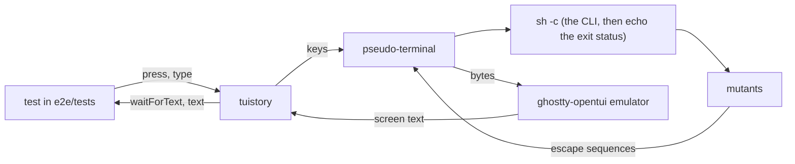
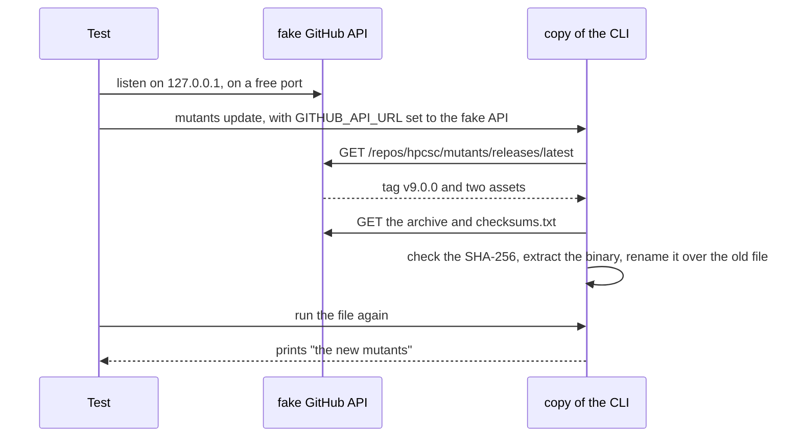
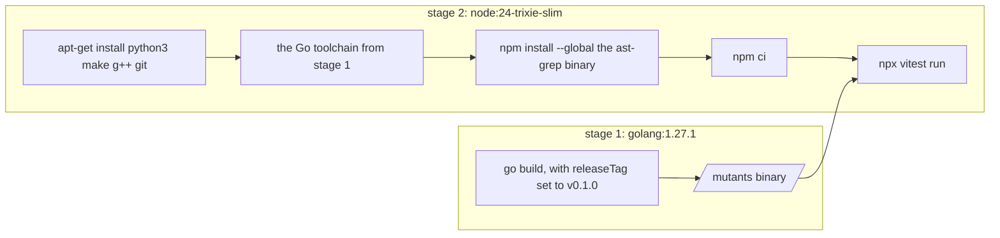

# How the end-to-end tests work

The end-to-end tests run the mutants binary as a person or an agent runs it. They find faults that the Go
tests cannot find: the real output, files on disk, processes that stay alive, and exit codes.

The tests are in `e2e/`. `e2e/testUtils.ts` has the helpers, and `e2e/tests/` has the tests.

## Parts

| Part | Job |
| --- | --- |
| vitest | Finds and runs the tests in `e2e/tests/`. |
| tuistory | Starts a program in a pseudo-terminal, sends keys to it, and gives its screen as text. |
| node-pty | Makes the pseudo-terminal for tuistory. |
| ghostty-opentui | The terminal emulator in tuistory. It turns the output of the CLI into a screen of text. |
| `testUtils.ts` | Makes throwaway folders and git repositories with Go modules, starts the CLI, and deletes the folders after each test. |

## Plain commands and screen tests

Two helpers start the CLI:

| Helper | Use for | How it works |
| --- | --- | --- |
| `runCli(cwd, args, env)` | Commands that print and stop, such as `run`, `rerun`, `version` and `update` | Starts the CLI as a child process with pipes. It gives stdout, stderr and the exit status. |
| `openCli(cwd, args, env)` | The screen, and commands that ask for input | Starts `sh -c 'printf "\033[20l"; <env> <cli> <args>; echo "EXIT:$?"'` in a pseudo-terminal. When the CLI stops, the shell writes its exit status on the screen, so a test can wait for `EXIT:0`. [New line mode](#new-line-mode) tells why the command starts with `printf`. |

`runCli` does not block. The update tests run a fake server in the test process, and that server must
answer while the CLI waits for it.

## New line mode

The emulator in tuistory starts in new line mode. In that mode, a line feed moves the cursor to the next
line and also back to column 1. A real terminal starts with the mode off, so a line feed keeps the column.

A full screen program, such as a Bubble Tea one, draws only the cells that change. It moves the cursor
down with a line feed and expects the column to stay the same. In new line mode, the text then goes to the
wrong column.

So `openCli` writes `\e[20l`, which turns new line mode off, before it starts the CLI.

## The run tests

Each run test makes a git repository with `goRepository(files)`. The repository holds a Go module and one
commit. The test then writes the code under test with `writeFiles`, so that git sees untracked files, and
runs `mutants run --base HEAD`. `runMutants(dir, args)` adds `--format json` and gives the mutants of the
report.

Each fixture has a known answer from the design:

| Fixture | Expected |
| --- | --- |
| Two figures of one type with equal values in the test | `NAMED_VALUE_SWAP` LIVED. With different values in the test: KILLED. |
| An error branch that no test enters | `BRANCH_IF` LIVED and `ERROR_REMOVE` NOT COVERED |
| A condition that holds the only use of a variable and of an import | `EXPRESSION_REMOVE` LIVED, not NOT VIABLE |
| A deadline that a test checks one hour before and one hour after | `CONDITIONALS_BOUNDARY` LIVED. With a check at the deadline itself: KILLED. |
| A due date three calendar days after a start, the `CALENDAR_DAY` rule of [operators.md](operators.md#operators-of-your-own) in the repository, and a test in UTC | `CALENDAR_DAY` LIVED. With a test in Sydney across the start of daylight saving time: KILLED. |
| A loop over a list that a test runs with one item | `BREAK_AT_END` LIVED. With two items: KILLED. |
| A busy loop and a removed `close` | TIMED OUT for both, and the child process of the test is not alive after the run |
| `diff.mnemonicPrefix=true` in the git config of the fixture | the same mutants as with `false` |
| An untracked new file | its mutants run, and `git status` is the same after the run |
| A folder name that differs from its package name | the mutants run the tests of that package |
| A test file with a build tag | with `--tags`, its tests run |
| Two runs | the same verdicts, mutant by mutant |
| A package with no test files | one row with the count of its mutants, and each mutant in the JSON |
| A file of proposals, with one that lives, one that dies and one whose `old` occurs two times | LIVED and KILLED, the third rejected with "old found 2 times", and `git status` the same after the run |
| A committed file, with `--operators=none` and `--proposals-anywhere`, and two proposals with the same edit and different refs | one mutant with both refs, the rejected proposal with its ref, and exit 2 for `--operators=none` alone |
| A proposed mutant after the run | `rerun` finds it by its id without the file. After its `old` changes: exit 1, "the proposal does not fit the code". |
| A new gate, and a changed caller that wires it in but whose tests use a fake | with `--caller-gaps`: the statements of the gate in the rows and the JSON, and exit 10 |

To keep each test short, a test names the operators that it needs with `--operators`.

## The update tests

The update tests start a fake GitHub API in the test process and point the CLI at it with
`GITHUB_API_URL`. The fake release holds an archive for the platform of the test and a `checksums.txt`.
The "new binary" in the archive is a shell script, so the test can see that the update replaced the file.

Each update test runs a copy of the CLI in its own folder. The update replaces that copy, so the other
tests keep the original binary.

## Where the tests run

| Command | Where | What it needs |
| --- | --- | --- |
| `task test:e2e` | Docker | Docker. CI runs this command. |
| `task test:e2e:local` | This machine | Node 24, Go, and ast-grep 0.45.0 or later |

For `task test:e2e:local`, the `node` on the `PATH` must be the Node 24 that mise installs. npm builds
node-pty for one version of Node, and vitest cannot load node-pty with another version. When an older Node
comes first on the `PATH`, put the Node of mise in front, for example with
`PATH="$(mise where node)/bin:$PATH" task test:e2e:local`.

Both commands build the CLI with the tag in `E2E_TAG` in `Taskfile.test.yml`, which is `v0.1.0`. They set
two environment variables for the tests: `EXECUTABLE`, the path of the binary, and `BUILD_TAG`, the tag.
The `version` and `update` tests compare the output of the CLI with `BUILD_TAG`.

The Docker image has two stages:

`python3`, `make` and `g++` let npm build node-pty when no prebuilt node-pty fits the platform. mutants
needs git, Go and ast-grep. The image installs the platform package of ast-grep, for example
`@ast-grep/cli-linux-arm64-gnu`, because that package holds the binary and needs no install script. The
image runs `npm ci` when `e2e/package-lock.json` is in the repository, and `npm install` when it is not.
Commit the lock file, so every run installs the same packages.

`task test:e2e` starts the container with `--init`. The init process reaps the processes that mutants
stops, so that a test can see that they are gone.

In GitHub Actions, the `e2e` job in `.github/workflows/ci.yml` runs `task test:e2e` on `ubuntu-latest`,
which has Docker. The release workflow calls the CI workflow, so a release waits for these tests too.

## How to write a new test

For a command that prints and stops:

1. Make a folder with `scratchDir()`, or a git repository with a Go module with `goRepository(files)`.
2. Run the command with `runCli(dir, args)`, or `mutants run` with `runMutants(dir, args)`.
3. Check the exit status, then the output.

For a command that shows a screen or asks for input:

1. Make a folder with `scratchDir()`.
2. Start the CLI with `openCli(dir)`.
3. Wait for text that shows that the screen is ready.
4. Send keys with `press`. Use `type` for text and for capital letters, because the key names in tuistory
   have lower case letters only.
5. Wait for the text that proves the result. Then check the rest of the screen with `expect`.

Keep these rules:

- **Wait for the text that you check, not for a title:** a program that loads in the background can show a
  title before its content.
- **Give each test its own folder:** `scratchDir()` makes the folder, and `onTestFinished` deletes it.
- **Do not change the terminal size:** `openCli` uses 160 columns and 40 rows, and the tests expect text
  that fits that size.
