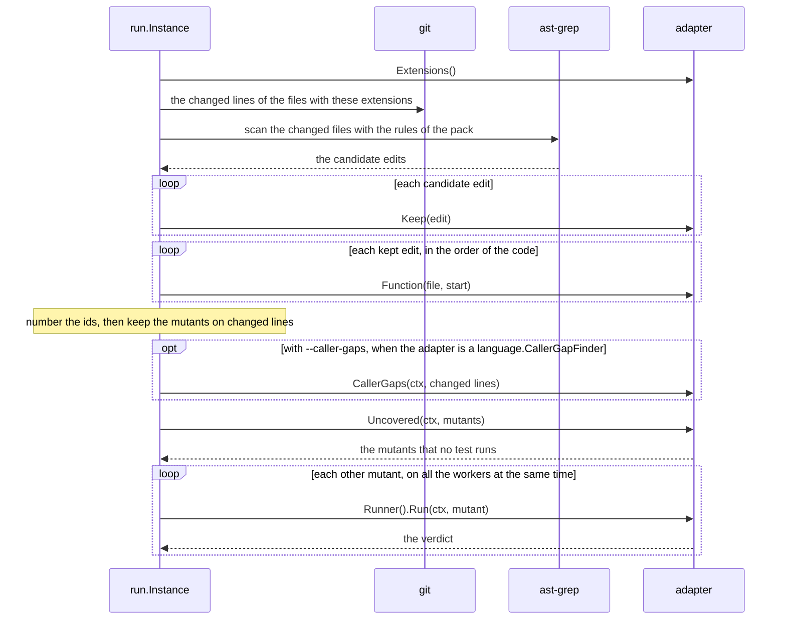

# Add a Language Adapter to mutants

`mutants` tests Go code. To test code in another language, you add a rule pack and a language adapter, and
you connect the adapter in the commands. The core in `internal/run` does not change, because it knows a
language only through the interface `language.Adapter`.

This page tells what each part does, what each method of the adapter must do, and which places in the code
name Go. [docs/design.md](design.md) tells how a run works.

## The parts of a language

| Part | Where | Does |
| --- | --- | --- |
| Rule pack | `internal/operator/operators/<language>/` | holds the ast-grep rules of each operator of the catalog |
| Skip rules | `internal/operator/skip/<language>/` | hold the ast-grep rules of the code that no operator changes, for example log calls |
| Hook | `internal/operator/` | makes the edits of an operator that a rule cannot express. Most operators need none. |
| Adapter | `internal/language/<language>/` | holds the filters, the function names of the ids, the coverage, the runner and the caller gaps |
| Connection | `internal/cmd/` | builds the adapter from the flags and `.mutants.yml`, and gives it to the run |
| Tests | the unit tests and `e2e/` | check the rules, the adapter, and the binary against small projects |

`<language>` is the name of the language in ast-grep, for example `typescript`.

## How a run calls the adapter



`mutants rerun ID` makes the same calls for one mutant, with no diff. A proposed mutant from `--proposals`
also goes through `Keep` and `Function`.

## Step 1: Choose the name and the extensions

- `Name()` gives the name of the language in ast-grep. The rule pack has this name as its folder, and each
  rule of the pack has it as its `language`. `operator.Load` refuses a rule for a different language, but it
  ignores case.
- The messages of `mutants` use the name, for example `the go adapter does not take this file`.
- `Extensions()` gives the file extensions with the dot, for example `[".ts"]`. The run reads the changed
  lines of these files only.
- ast-grep chooses the parser of a file from its extension, so each extension must belong to the language of
  the rules. For example, ast-grep parses a `.tsx` file as the language `tsx`, not as `typescript`.

## Step 2: Write the rule pack

Put one YAML file for each operator in `internal/operator/operators/<language>/`. The binary embeds the
folder, so a new pack needs no Go code.

```yaml
# internal/operator/operators/typescript/CONDITIONALS_BOUNDARY.yml, the first of its rules
id: CONDITIONALS_BOUNDARY/lt
language: typescript
rule:
  pattern: $A < $B
fix: $A <= $B
```

- The operator is the part of the id before the first `/`.
- Give rules for each operator of the catalog in `internal/operator/catalog.go`, and for no other operator.
  `operator.Load` refuses a pack that does not. Then `--operators`, `.mutants.yml` and
  [docs/operators.md](operators.md) mean the same thing in each language.
- Do not add an operator to the catalog when only one language can make its change. Such a change is a
  rule of a repository, as [docs/operators.md](operators.md#operators-of-your-own) shows for `CALENDAR_DAY`.
- The catalog says whether each operator runs by default, so a pack does not set it.
- Put the code that no operator must change, for example the log calls of the language, in a skip rule in
  `internal/operator/skip/<language>/`, not in the rule of each operator. A skip rule has no `fix`.
- A rule cannot know a type. Let the rule give each candidate, and let `Keep` choose. The Go pack does this
  for `RETURN_EMPTY`: it has one rule for each zero value, and the type filter keeps the zero value of the
  slot.
- Each rule needs a `fix`, unless a hook makes the edits of its operator.
- A repository can add its own rules in `.mutants/operators/<language>/`, and its own skip rules in
  `.mutants/skip/<language>/`. This works for each language with no more code.

### Hooks

A hook is Go code that makes the edits of an operator from all the matches of its rules in one file.
`NAMED_VALUE_SWAP` is the only hook: a rule can match each keyed value, but it cannot swap two values that are
next to each other.

- `operator.Load` adds each hook to the pack of each language, by the name of its operator. So a hook must
  work for each language that has its operator.
- The `NAMED_VALUE_SWAP` hook reads only the bytes between two matches: commas, white space, and `//`, `#`
  and `/* */` comments. It works for a language with this syntax when the rule binds each value to `$VALUE`.

## Step 3: Write the adapter

Make a package `internal/language/<language>`, and follow the Go adapter in `internal/language/golang`, or the
Python adapter in `internal/language/python`. The Python adapter is smaller: its runner has no build, and its
skip rules do most of its filters.

- `New(root string, settings Settings) language.Adapter` builds the adapter. `root` is the root of the
  repository.
- `Settings` holds the settings of the language, for example the build tags of Go.
- The adapter type is not exported. `var _ language.Adapter = (*adapter)(nil)` makes the compiler check it.

The run gives each file to the adapter as a path from the root of the repository, with `/` between the
folders.

### What each method must do

| Method | The run calls it | It must |
| --- | --- | --- |
| `Name()` | to load the pack, and in messages | give the name of the language in ast-grep |
| `Extensions()` | before it reads the diff | give the extensions of the files, with the dot |
| `IndentationMatters()` | before it reads the diff | give `true` when a change of the white space at the start of a line can change what the code does, as in Python. The run then counts a line whose only change is its white space. |
| `Keep(edit)` | one time for each candidate edit, before the ids | give `false` for an edit to drop. See [Filters](#filters). |
| `Function(file, offset)` | one time for each edit that `Keep` keeps | give the name of the declaration that holds the byte offset. See [Function names](#function-names). |
| `Uncovered(ctx, mutants)` | one time with all the mutants of a run, and one time in `rerun` | give the mutants that no test runs. See [Coverage](#coverage). |
| `Runner()` | before each mutant runs | give the `mutant.Runner` of the language. See [The runner](#the-runner). |

An adapter whose language has a check for caller gaps also implements `language.CallerGapFinder`, as the Go
adapter does. With `--caller-gaps`, the run calls `CallerGaps(ctx, changed)` of each such adapter that has
changed files. Do not implement it for a language without the check. A run whose changed files are only in
that language then has no caller gaps in its rows and its JSON, so no reader takes it for a check that
found 0 gaps.

### Filters

`Keep` drops a candidate before it costs a build. The Go adapter drops:

- an edit whose replacement is the same as the original
- an edit in a test file or in generated code
- an edit in a file that the build leaves out
- an edit that a type check finds wrong, for example a `RETURN_EMPTY` value that is not the zero value of its
  slot

`Keep` must depend only on the code, never on the diff. The number in an id counts the mutants after the
filters and before the scope. When a filter depends on the diff, one mutant gets two ids: one with
`--base HEAD`, and one with the base of the branch.

`Keep` takes no context and gives no error. When the adapter cannot read a file, `Keep` drops the edits of
that file, as the Go adapter does.

### Function names

The function name is the second part of each id, for example `(*Handler).accounts` in
`internal/order/handler.go:(*Handler).accounts:BRANCH_IF#1`.

- Give the same name for the same code in each run. An edit in another function must not change the name.
- Outside a function, give the name of the declaration that holds the offset, for example a variable.
  Give `""` when no declaration holds it.
- Do not put a `:` in the name. `mutants rerun` finds the function between the last two colons of the id.

### Coverage

`Uncovered` gives a map. Each key is the id of a mutant that no test runs, and each value is the detail of
its NOT COVERED verdict:

- `""` gives the mutant its own row.
- A text that holds for each mutant of one package, for example `package cmd/report has no test files`,
  gives one row for all the mutants with that text.

An error from `Uncovered` stops the run with exit code 2. Give an error when the tests fail with the real
code, because then no mutant can get a verdict.

A mutant in the map does not run, so put a mutant in the map only when the coverage proves that no test runs
it. The Go adapter puts a mutant in the map only when a profile block with a count of 0 holds its start.
An empty map is correct for a language with no coverage: each mutant then runs.

### The runner

`Run(ctx, m)` builds and tests the code with one mutant, and gives a `mutant.Verdict`:

| Status | When |
| --- | --- |
| KILLED | a test failed |
| LIVED | every test passed |
| NOT VIABLE | the code with the mutant does not build |
| TIMED OUT | the tests ran past their limit |
| INFRA ERROR | the computer stopped the tests, or the build ran past its limit |

`Run` never gives NOT COVERED, because that status comes from `Uncovered`. Put in `Detail` why the mutant has
its status, for example the first test that failed. The rows and `mutants rerun` show it.

The runner must:

- Never write to the work tree or to the git index. The Go runner writes the file with the mutant and an
  overlay into a temp folder, and `go test -c -overlay` reads them.
- Put the mutant into the source with `m.Apply(source)`. It gives an error when the source does not hold
  `m.Original` from `m.Start` to `m.End` any more.
- Run the tests with no cache, so that each verdict comes from a real test run.
- Accept calls from all the workers at the same time. Protect each cache with a mutex.
- Stop each child process when `ctx` ends, at `--limit` or at an interrupt. The Go runner starts each
  process in a process group of its own, and kills the group.
- Set the limit of the tests to `process.TestLimit` of a baseline run of the real code, and run them with
  `RunAgainAfterTimeout` of `process.Command`, as [Time limits](design.md#time-limits) tells.
- Give an error only when the whole run must stop. A problem with one mutant is an INFRA ERROR verdict.

The Python runner keeps the work tree clean with an import hook, as
[The Python runner](design.md#the-python-runner) tells. The [Later](design.md#later) section of the design
plans a TypeScript runner that keeps the work tree clean. It writes each mutant into a git worktree for each
worker, in a temp folder.

## Step 4: Connect the adapter in the commands

`run.New` takes a `run.Language` for each language: the adapter and the pack of its rules. The run gives each
changed file to the adapter that takes its extension, so one run tests each language that the diff changes.
Each mutant names its language, and the Stryker report gives each file that language.

The commands build each adapter and its pack in these places:

| Place | Does |
| --- | --- |
| `newInstance` in `internal/cmd/run.go` | builds the adapter of each language, and loads its pack |
| `runMutants` in `internal/cmd/run.go` and `rerunMutant` in `internal/cmd/rerun.go` | make the settings of each adapter from the flags and `.mutants.yml` |
| `listOperators` in `internal/cmd/operators.go` | lists the pack of each language |
| `config` in `internal/cmd/config.go` | holds the settings of each language |

## Step 5: Test the language

| Level | Add | Example |
| --- | --- | --- |
| Rules | a test for each rule against a small source | the `edits` tests in `internal/operator/pack_test.go` |
| Adapter | tests of the public methods against small projects in temp folders | `internal/language/golang/adapter_test.go` |
| End to end | a helper that makes a git repository with a project, and fixtures with known answers | `goRepository` in `e2e/testUtils.ts`, and the fixtures in [docs/e2e-tests.md](e2e-tests.md) |

- Start each Go test file with `//go:build unit`.
- The tests of `internal/run` use a fake adapter, so they need no change.
- Add the toolchain of the language to `e2e/Dockerfile`, so that the end-to-end tests can build and test the
  fixtures.
- Run the new pack on real branches before a release. Turn off by default each operator whose survivors are
  mostly not gaps in the tests.

## Step 6: Update the documents

| Document | Add |
| --- | --- |
| [README.md](../README.md) | the language, and the tools that it needs |
| [docs/install.md](install.md) | the tools of the language |
| [docs/usage.md](usage.md) | the flags and the settings of the language |
| [docs/operators.md](operators.md) | the operators of the pack |
| [docs/design.md](design.md) | the filters and the runner of the language |
