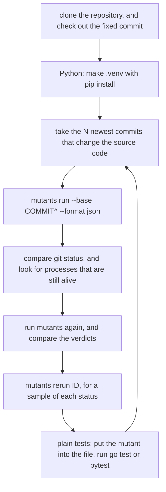

# The Regression Test of mutants on Open-Source Repositories

The unit tests and the end-to-end tests run `mutants` on small projects that the tests write. The author of
each project knew the answer, so these tests cannot find a wrong verdict on code that nobody wrote for a
test. The regression test runs `mutants` on the newest commits of real open-source repositories, and checks
each run with rules that need no expected answer. Each repository has a fixed commit, so each run of the
regression test sees the same code.

The regression test is a separate program in `cmd/regression`. It starts the `mutants` binary as a user
does, and it does not import the code of `mutants`. The release builds only `cmd/mutants`.

A wrong verdict costs the most in production use. A false KILLED hides a gap in the tests. A false LIVED
makes a developer write a test that is not needed.

## Run the regression test

```shell
task test:regression
task test:regression -- -only cobra,click -commits 2
```

The task builds `bin/mutants`, and then runs `go run ./cmd/regression`. The regression test needs git, Go,
Python 3 and ast-grep, and it downloads the repositories and the Python packages of their tests. It does not
run in CI, because a full run takes hours.

| Flag | Default | Does |
| --- | --- | --- |
| `-only NAMES` | each repository | checks only these repositories, by name, split by commas |
| `-commits N` | 5 | checks the N newest commits that change the source code of each repository |
| `-sample N` | 3 | gives `rerun` and the plain tests N mutants of each status in each commit |
| `-repeat` | true | runs `mutants` two times on each commit, and compares the verdicts |
| `-plain-runs N` | 20 | runs the plain tests up to N times before a disagreement is a finding |
| `-limit DURATION` | 20m | gives each run of `mutants` this `--limit` |
| `-mutants PATH` | `bin/mutants` | checks this binary |
| `-work FOLDER` | `mutants-regression` in the cache folder of the user | holds the clones and `results.json` |
| `-repositories PATH` | `cmd/regression/repositories.yml` | lists the repositories |

The regression test exits 0 when it finds nothing, 1 when it finds a fault or cannot check a repository, and 2
for a usage error.

## How the regression test works



For each commit, the regression test runs `mutants run --base COMMIT^` with the commit checked out. The run
then tests the lines that the commit changes, as it tests the lines of a branch.

| Check | Finding when |
| --- | --- |
| exit code | `mutants run` exits with a code that `docs/usage.md` does not give, or with exit 2 for a reason other than tests that fail with the real code. Also when the output has a panic of `mutants`, the JSON report does not parse, or the run does not stop at its limit. |
| work tree | `git status --porcelain --ignored --untracked-files=all` is different after the run |
| processes | a process that the run started is alive 3 seconds after `mutants` stops. The regression test then stops it. |
| second run | a mutant gets another status in the second run, or is in only one of the two runs |
| rerun | `mutants rerun ID` gives another status or another exit code than the run |
| plain tests | plain `go test` or `pytest`, with the mutant in the file, does not agree with the status. Also when the line and the column of the report do not hold the original text. |

A finding names its check, the id of the mutant, and what the check saw:

```text
shop 3f2a9c1e07: exit 10 in 4s, 2 mutants (KILLED 1, LIVED 1), 2 reruns, 2 plain tests
  FINDING plain tests calc/calc.go:Discount:INTEGER_DECREMENT#1: LIVED, but a plain test fails: --- FAIL: TestDiscount (0.00s)
```

`results.json` in the work folder holds each commit, its mutants and its findings.

### The plain tests

The plain tests check a verdict without the code of `mutants`. The regression test reads the line, the column,
the original text and the replacement of the mutant from the JSON report, puts the replacement into the file
in the clone, runs the tests, and then writes the real code back.

| Language | The mutant does not build when | The tests fail when |
| --- | --- | --- |
| Go | `go test -c -vet=off` fails in the folder of the package | `go test -count=1 -vet=off -failfast` fails in the folder of the package |
| Python | `compile()` of the file fails | `pytest -q -x` fails in the folder of the project. It runs all the tests of the project, so a test that `mutants` did not select also counts. |

| Status | Finding when |
| --- | --- |
| LIVED | a plain test fails, or the mutant does not build |
| NOT COVERED | a plain test fails |
| KILLED | each plain test passes, or the mutant does not build |

For Go, a test of a changed caller can kill a mutant. So for a KILLED mutant that the tests of its own package
let live, the regression test also runs the tests of up to 20 packages of the module that import the package.

When `mutants` stops because the tests of a package fail with the real code, the regression test runs the
plain tests of that package. When they pass in each run, that is a finding.

A test that depends on timing, or on the order of the tests, can kill a mutant in one run and let it live in
the next. So before a finding of the plain tests, of the second run or of `rerun`, the regression test runs
the plain tests again, up to `-plain-runs` times. It stops as soon as one run passes and one run fails, and
the disagreement is then a skip and not a finding. The `TestVersion6` of uuid, for example, fails in about 3
of 20 runs with some of its mutants.

### Skips

A skip is not a finding. The regression test shows each skip with its reason:

- The plain tests of the package or the project fail with the real code, so they cannot check a verdict.
- The plain tests ran past 15 minutes.
- The plain tests pass in some runs and fail in others, with the mutant or with the real code.
- A Go mutant leaves a variable, an import or a label unused. `mutants` repairs the name before it builds
  the mutant, and a plain build cannot do that.

## The repositories

`cmd/regression/repositories.yml` lists each repository with a fixed commit:

```yaml
- name: click
  url: https://github.com/pallets/click
  commit: 2247b35ea1c47c727d7a06e51fa280e12a863ff6
  language: python
  install: ["-e", ".", "pytest", "coverage"]
```

| Field | Value |
| --- | --- |
| `name` | the name for `-only`, and the folder of the clone |
| `url` | the URL that `git clone` takes |
| `commit` | the full sha of the newest commit to check |
| `language` | `go` or `python` |
| `install` | Python only: the arguments of `pip install` for the venv of the tests. It must hold the package itself, pytest, coverage.py and each package that the tests import. |

To add a repository, choose one with good tests, and give it a commit. Run the regression test on it alone
with `-only`, and read each skip: a repository whose plain tests fail with the real code gives no check of a
verdict.

A tool on the `PATH` can change which tests run. With `pyright` on the `PATH`, a test of attrs runs, and it
fails against another version of pyright than the one that attrs expects. Then each commit of attrs stops
with exit 2, and gives a skip. Take such a tool out of the `PATH` for the run.

The regression test makes the venv of a Python repository in `.venv` in the clone, and adds `.venv` to
`.git/info/exclude`. `mutants` uses `.venv/bin/python`, and it tests each line of an untracked file, so the
venv must not be untracked.
