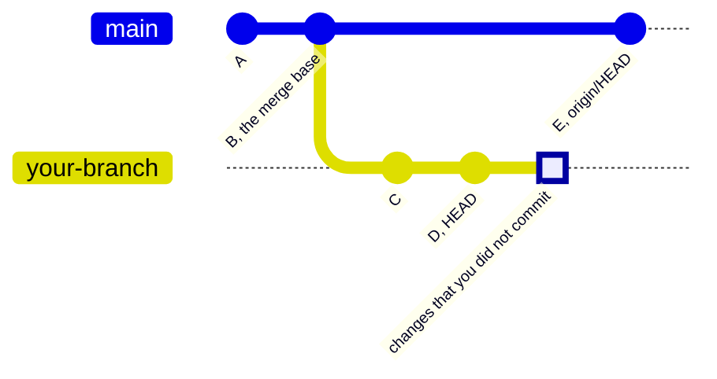
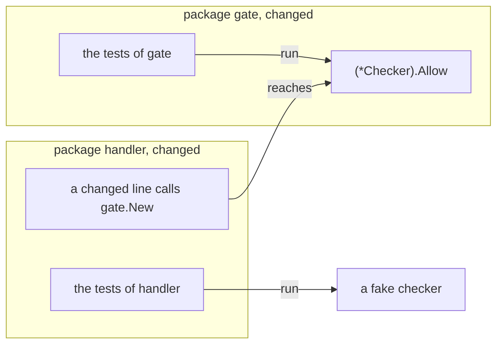
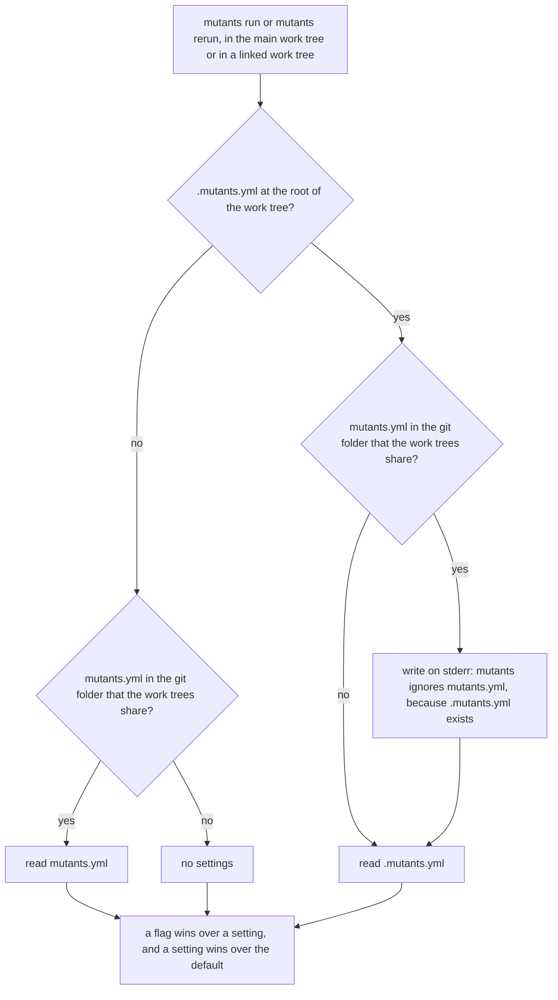

# Commands, Flags and Settings of mutants

This page lists each command of `mutants`, its flags and its exit codes, the formats of its reports, and the
settings that a repository keeps in `.mutants.yml`. The [README](../README.md) shows a first run.

## The lines that a run tests

`mutants run` makes mutants only on the changed lines:



In this example, the run tests the lines that changed from B to the work tree. E came to the base after B,
so its lines do not count.

- It compares the work tree with the merge base of `HEAD` and the base. The merge base is the point where
  the branch left the base, so commits that land on the base later do not count.
- The base is `origin/HEAD`, unless `--base` or `.mutants.yml` sets another one.
- It includes the lines that you did not commit, and each line of an untracked file.
- `mutants run --base HEAD` tests only the changes that you did not commit.
- `mutants run --all FOLDER...` tests each line of the files in each folder, tracked or untracked.
  `FOLDER/...` adds the subfolders.

A mutant runs when its change touches a changed line. `mutants` never writes to the work tree or to the git
index. When the changed lines give no mutant, it says so in one line:

```text
no mutant: 0 changed lines in 0 files (base 1a2b3c4d5e)
```

## Commands

| Command | Does |
| --- | --- |
| `mutants run` | runs the mutants of the changed lines |
| `mutants run --all FOLDER...` | runs the mutants of each line in the folders |
| `mutants rerun ID` | runs one mutant again, by its id, with no diff and no cache |
| `mutants operators` | lists each operator of each language, whether it runs by default, and its rules |
| `mutants config init` | writes a first `.mutants.yml`, see [Settings in .mutants.yml](#settings-in-mutantsyml) |
| `mutants version` | prints the version, see [docs/install.md](install.md) |
| `mutants update` | installs the latest release, see [docs/install.md](install.md) |

## Flags of mutants run

| Flag | Does |
| --- | --- |
| `--base REF` | compares with the merge base of `HEAD` and `REF`. The default is `origin/HEAD`. |
| `--all FOLDER...` | tests each line of the files in each folder |
| `--workers N` | tests `N` mutants at the same time. The default is 4. |
| `--limit DURATION` | stops the whole run after this time, prints the mutants that have a status, and exits with 124 |
| `--build-limit DURATION` | the least time for the build of one mutant. The default is 2 minutes. See [Time limits](#time-limits). |
| `--tags a,b` | the build tags for `go list`, for the coverage run and for each build |
| `--operators=-NAME,+NAME` | `-NAME` takes an operator out, `+NAME` adds one, and `NAME` with no sign runs only the named operators. `none` runs no operator, for example to run only `--proposals`. A run with no operator, no proposal and no `--caller-gaps` exits with 2. |
| `--format rows\|json` | prints rows, or one JSON document. The default is rows. |
| `--json PATH` | also writes the JSON report to `PATH` |
| `--stryker PATH` | also writes the Stryker report to `PATH` |
| `--proposals PATH` | also runs the mutants that the file proposes. See [Proposed mutants](#proposed-mutants). |
| `--proposals-anywhere` | accepts a proposal also on a line that the diff does not change. It needs `--proposals`. |
| `--caller-gaps` | also finds the changed statements that no test of a changed caller runs. See [Caller gaps](#caller-gaps). |

## Flags of mutants rerun

`mutants rerun` takes the id in `[ ]` at the end of a row:

```shell
mutants rerun 'internal/order/handler.go:(*Handler).accounts:BRANCH_IF#1'
```

It finds the mutant with all the rules of its operator, also an operator that is off by default. It needs
no diff, so it also works after a commit. It prints one row, and the detail of the status below the row.

| Flag | Does |
| --- | --- |
| `--tags a,b` | the build tags for `go list`, for the coverage run and for the build |
| `--build-limit DURATION` | the least time for the build of the mutant |

## Exit codes

Each command exits 2 for a usage error, for example a flag that it does not know.

| Command | Code | Meaning |
| --- | --- | --- |
| `mutants run` | 0 | no mutant survived |
| | 10 | at least one mutant survived, or the run found a caller gap |
| | 124 | the run reached `--limit` |
| | 2 | a usage error or a tool error, for example a test that fails with the real code, or a file of proposals that `mutants` cannot read |
| | 130 | an interrupt or SIGTERM stopped the run |
| `mutants rerun` | 0 | a test killed the mutant |
| | 10 | the mutant lived, or no test runs its line |
| | 1 | no verdict: the mutant timed out, did not build, or the computer stopped it, or the proposal of the mutant does not fit the code |
| | 2 | the text is not a mutant id, or no mutant has this id |

## Statuses

| Status | Meaning | Survivor |
| --- | --- | --- |
| KILLED | a test failed | no |
| LIVED | every test passed | yes |
| NOT COVERED | no test runs the line | yes |
| NOT VIABLE | the mutant does not build | no |
| TIMED OUT | the tests ran past their time limit two times | no |
| INFRA ERROR | the computer stopped the run, for example when it had no more memory, or the build ran past its limit | no |

A package whose tests fail with the real code stops the run with exit code 2, because its mutants cannot get
a verdict.

## Rows

The rows are the default output. They show only the mutants that need a look, grouped by status:

```text
LIVED:
  internal/order/handler.go:42 BRANCH_IF: { return nil, fmt.Errorf("load the accounts ... -> {}  [internal/order/handler.go:(*Handler).accounts:BRANCH_IF#1]
NOT COVERED:
  package cmd/report has no test files: 12 mutants
  internal/order/handler.go:43 ERROR_REMOVE: fmt.Errorf("load the accounts ... -> nil  [internal/order/handler.go:(*Handler).accounts:ERROR_REMOVE#1]
mutants: 81, killed: 64, lived: 1, not covered: 15, not viable: 1 (base 1a2b3c4d5e)
```

- Each row gives the file and the line, the operator, the code before and after the change, and the id.
- A row cuts the code at 40 characters. When the code is long, the row starts a few words before the
  first difference, so that you see the difference.
- An empty replacement shows as `(nothing)`.
- A package with no test files gives one row for all its mutants.
- The last line counts the mutants of each status, and gives the base.

The progress lines and the messages go to stderr, so they do not mix with a report on stdout.

## Proposed mutants

An agent, or a person, can propose bugs that no operator makes, for example a condition that is too narrow
for the rule of the business. Write each proposal as one JSON object on one line of a file:

```json
{"file": "internal/order/wait.go", "old": "waited && !note", "new": "waited && open && !note", "bug": "a note after the deadline does not stop the close"}
```

| Field | Holds |
| --- | --- |
| `file` | the path of the file from the repository root |
| `old` | the exact text to replace. It must occur once in the file. |
| `new` | the text that takes its place, or `""` to remove `old` |
| `bug` | the bug that the edit puts in the code, in one sentence |
| `ref` | optional: a text that the JSON report gives back on the mutant, so a tool can match each result to its source, for example a review finding |

Then give the file to the run:

```shell
mutants run --proposals proposals.jsonl
```

- Each proposal whose edit touches a changed line becomes a mutant with the operator `PROPOSED`. Its row
  shows the bug in place of the code.
- Each other proposal is rejected. The rows list it under `REJECTED PROPOSALS` with its reason, for
  example `old found 3 times` or `not on a changed line`.
- The last line counts the proposals: `proposals: 7 accepted, 1 rejected`.
- Proposals with the same edit make one mutant. Each of them counts as accepted, and the mutant carries the
  `ref` of each in `refs` in the JSON report. A rejected proposal keeps its `ref` in the JSON report too.
- `--proposals-anywhere` accepts a proposal on any line, for example to check a review finding about a test
  that the diff made weaker. The operators still mutate only the changed lines.
- The number in the id of a proposed mutant comes from `old` and `new`, so the id stays the same when the
  other proposals change.
- `mutants` keeps the accepted proposals in the git folder, so `mutants rerun ID` works without the file.
  When `old` does not occur once in the file any more, `rerun` exits with 1 and says that the proposal does
  not fit the code.

`mutants` never calls a model itself. The agent that proposes the bugs writes the file.

## Caller gaps

A change can wire new code of one package into another changed package while the tests of the caller use a
fake, so no test runs the new code from the caller. `--caller-gaps` finds these lines:

```shell
mutants run --caller-gaps
```



In this example, the tests of `gate` run `Allow`, so the mutants of `Allow` die. A changed line of `handler`
calls `gate.New`, so `handler` reaches `Allow`. But the tests of `handler` use a fake checker, so no test of
a caller runs `Allow`. The changed statements of `Allow` are a caller gap.

- A caller is a changed package that imports another changed package.
- `mutants` runs the tests of each caller one more time, and follows the code that the changed lines of the
  caller reach.
- A caller gap is a changed statement that the tests of its own package run, but that no test of a caller
  runs.
- When the changed lines of a caller call only an interface of the caller, the caller gives no gap.

The rows list the gaps under `CALLER GAPS`, by function, and a last line counts them:

```text
CALLER GAPS:
  gate/gate.go:16-17,19 (*Checker).Allow, not run by the tests of handler
mutants: 3, killed: 2, lived: 1 (base 1a2b3c4d5e)
caller gaps: 1
```

A run that stops at `--limit` before the check ends lists no caller gaps. A run whose changed files are only
in Python also lists none, because the check looks at Go code only. A run that finds a caller gap exits
with 10. The check is off by default. Turn it on for each run with
`caller_gaps: true` in `.mutants.yml`.

## Mutant ids

An id has this shape:

```text
<file from the repository root>:<function>:<operator>#<n>
internal/order/handler.go:(*Handler).accounts:BRANCH_IF#1
```

`n` counts the mutants of that operator in that function, in the order of the code. So a change in another
function does not change the id, and the id is the same with `--base HEAD` and with the base of the branch.
For a proposed mutant, `n` comes from the text of its edit.

## The JSON report

`--format json` prints one JSON document, and `--json PATH` writes the same document to a file. It holds
each mutant, also the killed ones:

```json
{
  "base": "4eea6345364a533490b97b7ed4d7b188d1c99e5c",
  "mutants": [
    {
      "id": "shop/discount.go:Discount:CONDITIONALS_BOUNDARY#1",
      "file": "shop/discount.go",
      "line": 5,
      "column": 5,
      "operator": "CONDITIONALS_BOUNDARY",
      "status": "KILLED",
      "original": "total >= 100",
      "replacement": "total > 100",
      "detail": "--- FAIL: TestDiscount (0.00s)"
    }
  ]
}
```

`detail` tells why the mutant has its status, for example the test that failed or the build error. It is
not there when the status has no detail. `bug` holds the bug of a proposed mutant.

With `--proposals`, the document also holds `proposals`, with the number of accepted proposals and each
rejected proposal with its reason:

```json
"proposals": {
  "accepted": 7,
  "rejected": [{"file": "a.go", "old": "return", "new": "", "bug": "the case never closes", "reason": "old found 3 times"}]
}
```

With `--caller-gaps`, the document also holds `callerGaps`, also when the run found none. A run that stops
at `--limit` before the check ends has no `callerGaps`.

```json
"callerGaps": [{"file": "gate/gate.go", "function": "(*Checker).Allow", "lines": [16, 17, 19], "callers": ["handler"]}]
```

The JSON encoder writes `<`, `>` and `&` in strings as `\u003c`, `\u003e` and `\u0026`, and a JSON parser
reads them back as the same characters.

## The Stryker report

`--stryker PATH` writes version 2 of the
[mutation-testing-elements](https://github.com/stryker-mutator/mutation-testing-elements) report format.
Its HTML viewer shows each mutant in the code of its file.

## Settings in .mutants.yml

A repository can keep its settings in `.mutants.yml` at its root. A flag wins over the file. To keep the
settings out of the repository, see [Settings that git does not track](#settings-that-git-does-not-track).

`mutants config init` writes a first `.mutants.yml` at the root of the repository:

- `base` is the default branch of origin, such as `origin/main`, when the clone knows it.
- `go.tags` lists the build tag of the test files when they need one tag, such as `unit`. When they need
  more than one, the file lists each tag with its number of files, and you choose. A tag such as
  `integration` can need a service, such as a database.
- Each other setting is a comment.

`mutants config init` does not replace a `.mutants.yml` that exists, and then it exits with 2.

```yaml
base: origin/main
workers: 4
operators: [-ERROR_CAUSE_REMOVE]
exclude: ["**/*_gen.go", "vendor/**"]
caller_gaps: true
go:
  tags: [unit]
  zero_functions: [maybe.None, caseautoresolve.Submitted]
python:
  command: [uv, run, python]
```

| Key | Does |
| --- | --- |
| `base` | the base of the changed lines, as `--base` |
| `workers` | the number of mutants that run at the same time, as `--workers` |
| `operators` | the operators, as `--operators`. The names are the same in each language. |
| `exclude` | the files that get no mutant, as globs from the repository root. `["**/*.py"]` leaves a language out of each run. |
| `caller_gaps` | `true` looks for caller gaps in each run, as `--caller-gaps` |
| `go.tags` | the build tags, as `--tags` |
| `python.command` | the command that starts the Python of a project, in the folder of the project. See [Python](#python). |
| `go.zero_functions` | the functions that return the zero value of their type, as `package.Function`. `NAMED_VALUE_REMOVE` skips a field whose value is a call of one of them, and `RETURN_EMPTY` skips a struct literal whose fields are all such calls, because the change gives the same value. Use the name of the package, not its path. |

The settings of one language are under the key of the language, such as `go`. An unknown key is an error
that names the key, its line and the known keys.

### Settings that git does not track

Put the settings that only your work uses in `mutants.yml` in the git folder that all work trees of the
clone share. `git rev-parse --git-common-dir` gives that folder, for example `.git`:

```sh
mutants config init
mv .mutants.yml "$(git rev-parse --git-common-dir)/mutants.yml"
```

- Git does not track the file. One file serves the main work tree and each linked work tree, for example a
  work tree of `git worktree add`.
- An error in `mutants.yml` names its path, for example `unknown key workerz in .git/mutants.yml (line 1)`.

`mutants run` and `mutants rerun` find the settings in this order. They read one file at most, so the
settings of the two files do not merge:



## Your own operators

A repository can add its own operators as [ast-grep](https://ast-grep.github.io) rules with a `fix`. Put
each rule in a YAML file in `.mutants/operators/go/`:

```yaml
id: NIL_MAP
language: go
rule:
  pattern: map[$K]$V{}
fix: nil
```

- The operator is the part of the id before the first `/`. So the rules `NIL_MAP/empty` and `NIL_MAP/make`
  make one operator, `NIL_MAP`.
- A rule with the id of a standard rule replaces that rule.
- A rule with `metadata: {default: off}` runs only when `--operators` or `.mutants.yml` names its operator.
  A rule for an operator that is off by default, such as `ERROR_CAUSE_REMOVE`, is also off by default.
- `mutants operators` lists each rule, and the file of each rule that the repository adds.

## Code that mutants skips

A skip rule is an [ast-grep](https://ast-grep.github.io) rule with no `fix`. `mutants` makes no mutant inside
a match of a skip rule, and it does not empty a branch that holds only such matches. The standard skip rule
of Go, `zerolog`, matches a zerolog call that ends in `Msg`, `Msgf` or `Send`. The standard skip rules of
Python match a call of a logger, such as `logger.info(...)`, a type annotation, an `if TYPE_CHECKING:` block,
a test file, and a file whose first comments say that it is generated.

To skip the calls of another logger, or other code whose change no test can see, put a rule in a YAML file
in `.mutants/skip/go/`:

```yaml
id: slog
language: go
rule:
  kind: call_expression
  has:
    field: function
    regex: ^slog\.(Debug|Info|Warn|Error)$
```

- A skip rule with the id of a standard skip rule replaces that rule.
- A skip rule with a `fix` stops the run with an error, because a skip rule changes no code.

## Python

`mutants` runs the tests of Python code with pytest.

- **The project.** The project of a file is the nearest folder above it with `pyproject.toml`, `setup.cfg`,
  `setup.py`, `pytest.ini` or `tox.ini`, or else the root of the repository. pytest runs in the folder of
  the project, so a repository can hold more than one Python project.
- **The Python of a project.** `python.command` in `.mutants.yml` starts it, for example
  `command: [uv, run, python]`, or `command: [poetry, run, python]` for a venv that Poetry keeps outside the
  project. Without the setting, `mutants` takes `.venv/bin/python` of the project when it exists, and
  `python3` when it does not.
- **pytest and coverage.py.** The environment of the tests must have both. pytest-cov installs coverage.py.
  Without coverage.py, the run stops with exit 2, and the message names the project.
- **The code of the repository.** The tests must import the files of the repository, for example through an
  editable install or `pythonpath` in the settings of pytest. A test that imports a copy in `site-packages`
  tests no mutant.
- **The tests of a mutant.** `mutants` runs the tests of each project one time with coverage.py, and then
  gives each mutant only the tests that run its line. A line that runs when its module loads, such as a
  constant, runs each test of the project.
- **pytest-xdist.** `mutants` turns pytest-xdist off, because its own workers already test mutants at the
  same time. When `addopts` holds `-n`, pytest stops with a usage error. Take `-n` out of `addopts`.
- **Limits.** A comparison chain such as `0 < x < 10` gets no `CONDITIONALS_BOUNDARY` or
  `CONDITIONALS_NEGATION` mutant. A line that runs only in a process that a test starts is NOT COVERED,
  because coverage.py does not measure that process. `--caller-gaps` looks at Go code only.

## Time limits

| Limit | Value |
| --- | --- |
| The build of one mutant | 3 × the time of the build of the real code of its package, and at least `--build-limit` |
| The tests of one mutant | 3 × the time of the tests of its package with the real code, plus 5 s |
| The whole run | `--limit`, with no limit by default |

The load of the computer can grow during a run. So a mutant whose tests run past their limit runs one more
time with twice the limit. It is TIMED OUT only when the second run also runs past the limit.

## Workers

| Setting | Default | Notes |
| --- | --- | --- |
| `--workers` | 4 | each worker tests one mutant at a time |
| `-p` in `GOFLAGS` | 2 | for each build, unless you set `GOFLAGS` |
| `GOMAXPROCS` of the tests | the number of CPUs ÷ the number of workers | so the tests of all the workers do not use all the CPUs at the same time |
